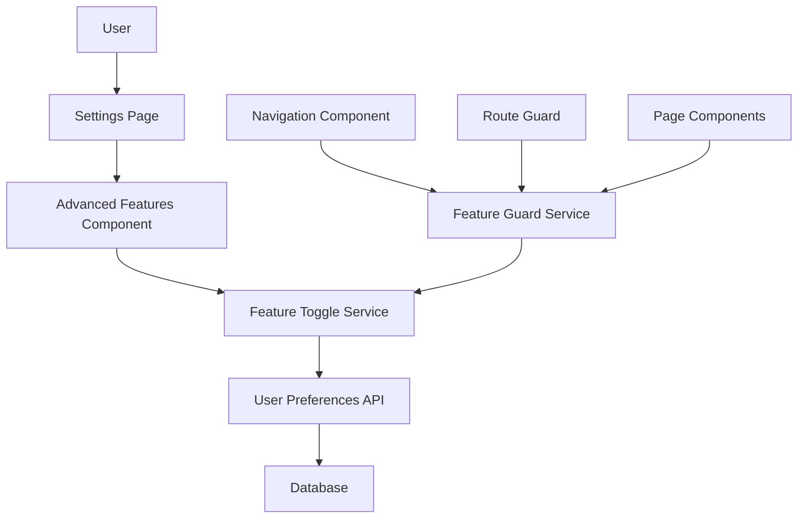
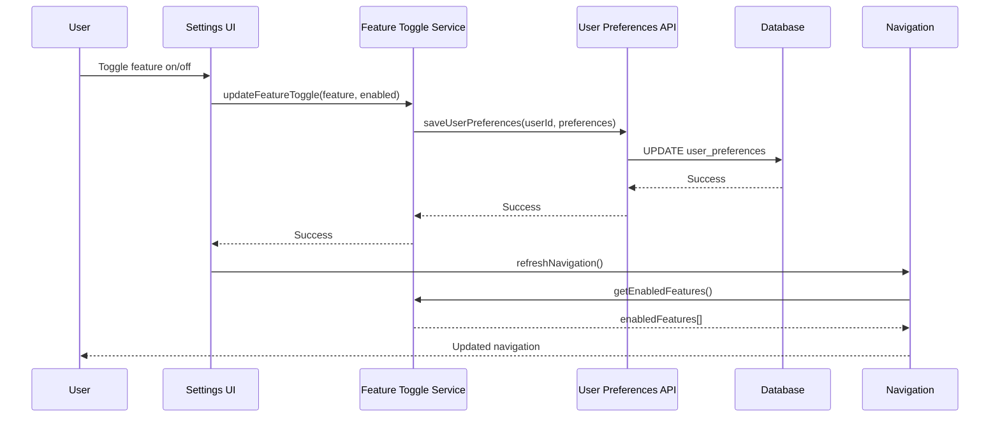

# Design Document

## Overview

The Advanced Features Toggle system implements a user-configurable settings interface that allows users to selectively enable advanced/optional pages in the Lexo application. This design follows a progressive disclosure pattern, simplifying the initial user experience while preserving access to powerful features for experienced users.

The system consists of three main components:
1. **Feature Toggle Management** - Backend service for managing user preferences
2. **Settings UI** - Frontend interface for configuring advanced features
3. **Navigation Control** - Dynamic navigation system that respects feature toggles

## Architecture

### High-Level Architecture



### Data Flow



## Components and Interfaces

### 1. Feature Toggle Service

**Purpose**: Centralized service for managing feature toggle state and persistence.

**Interface**:
```typescript
interface FeatureToggleService {
  // Get current feature states
  getEnabledFeatures(): Promise<AdvancedFeature[]>;
  
  // Toggle a specific feature
  toggleFeature(feature: AdvancedFeature, enabled: boolean): Promise<void>;
  
  // Check if a feature is enabled
  isFeatureEnabled(feature: AdvancedFeature): boolean;
  
  // Get features by category
  getFeaturesByCategory(category: FeatureCategory): AdvancedFeature[];
  
  // Subscribe to feature changes
  onFeatureChange(callback: (feature: AdvancedFeature, enabled: boolean) => void): () => void;
}
```

### 2. Advanced Features Settings Component

**Purpose**: UI component within the Settings page for managing advanced features.

**Location**: New tab in existing SettingsPage component

**Interface**:
```typescript
interface AdvancedFeaturesSettingsProps {
  onFeatureToggle: (feature: AdvancedFeature, enabled: boolean) => void;
  enabledFeatures: AdvancedFeature[];
  loading: boolean;
}
```

### 3. Feature Guard Service

**Purpose**: Controls access to advanced pages based on user preferences.

**Interface**:
```typescript
interface FeatureGuardService {
  // Check if user can access a page
  canAccessPage(page: string): boolean;
  
  // Get accessible navigation items
  getAccessibleNavItems(): NavigationItem[];
  
  // Redirect handler for disabled features
  handleDisabledFeatureAccess(page: string): void;
}
```

### 4. Enhanced Navigation Component

**Purpose**: Dynamic navigation that shows/hides items based on feature toggles.

**Modifications to existing Navigation component**:
- Filter navigation items based on enabled features
- Add feature guard checks
- Handle disabled feature access attempts

## Data Models

### User Preferences Schema

```typescript
interface UserPreferences {
  id: string;
  user_id: string;
  advanced_features: {
    financial_growth_tools: boolean;
    ai_document_intelligence: boolean;
    professional_development: boolean;
  };
  feature_discovery: {
    notification_shown: boolean;
    notification_dismissed_at?: Date;
  };
  created_at: Date;
  updated_at: Date;
}
```

### Advanced Feature Definition

```typescript
interface AdvancedFeature {
  id: string;
  name: string;
  description: string;
  category: FeatureCategory;
  pages: string[];
  icon?: string;
  tooltip?: string;
  enabled: boolean;
}

enum FeatureCategory {
  FINANCIAL_GROWTH_TOOLS = 'financial_growth_tools',
  AI_DOCUMENT_INTELLIGENCE = 'ai_document_intelligence',
  PROFESSIONAL_DEVELOPMENT = 'professional_development'
}
```

### Feature Configuration

```typescript
const ADVANCED_FEATURES: AdvancedFeature[] = [
  {
    id: 'strategic-finance',
    name: 'Strategic Finance',
    description: 'Advanced cash flow forecasting and factoring tools',
    category: FeatureCategory.FINANCIAL_GROWTH_TOOLS,
    pages: ['strategic-finance'],
    icon: 'TrendingUp',
    tooltip: 'Includes cash flow analysis, factoring tools, and financial projections'
  },
  {
    id: 'practice-growth',
    name: 'Practice Growth',
    description: 'Tools for finding new work, briefs, and referrals',
    category: FeatureCategory.FINANCIAL_GROWTH_TOOLS,
    pages: ['practice-growth'],
    icon: 'Users',
    tooltip: 'Brief analysis, referral engine, and business development tools'
  },
  {
    id: 'advanced-reports',
    name: 'Advanced Reports',
    description: 'Comprehensive reporting and analytics dashboard',
    category: FeatureCategory.FINANCIAL_GROWTH_TOOLS,
    pages: ['reports'],
    icon: 'BarChart3',
    tooltip: 'Detailed analytics, custom reports, and performance metrics'
  },
  {
    id: 'document-intelligence',
    name: 'Document Intelligence',
    description: 'AI-powered document analysis and insights',
    category: FeatureCategory.AI_DOCUMENT_INTELLIGENCE,
    pages: ['document-intelligence'],
    icon: 'FileSearch',
    tooltip: 'AI document analysis, contract review, and legal insights'
  },
  {
    id: 'ai-analytics',
    name: 'AI Analytics Dashboard',
    description: 'Comprehensive AI analytics and performance metrics',
    category: FeatureCategory.AI_DOCUMENT_INTELLIGENCE,
    pages: ['ai-analytics'],
    icon: 'Brain',
    tooltip: 'AI performance tracking, usage analytics, and optimization insights'
  },
  {
    id: 'precedent-bank',
    name: 'Precedent Bank',
    description: 'Legal precedent research and management tools',
    category: FeatureCategory.AI_DOCUMENT_INTELLIGENCE,
    pages: ['precedent-bank'],
    icon: 'BookOpen',
    tooltip: 'Legal precedent database, case law research, and citation management'
  },
  {
    id: 'academy',
    name: 'Professional Academy',
    description: 'CPD tracking and peer networking features',
    category: FeatureCategory.PROFESSIONAL_DEVELOPMENT,
    pages: ['academy'],
    icon: 'GraduationCap',
    tooltip: 'CPD tracking, professional development, and peer networking'
  },
  {
    id: 'workflow-integrations',
    name: 'Workflow Integrations',
    description: 'Third-party software integrations and automation',
    category: FeatureCategory.PROFESSIONAL_DEVELOPMENT,
    pages: ['workflow-integrations'],
    icon: 'Workflow',
    tooltip: 'Connect with external tools, automate workflows, and sync data'
  }
];
```

## Error Handling

### Feature Access Control

1. **URL Access Prevention**: Route guards check feature status before allowing access
2. **Navigation Filtering**: Navigation items are filtered based on enabled features
3. **Graceful Degradation**: Disabled features show informational messages instead of errors
4. **Fallback Routing**: Attempts to access disabled features redirect to dashboard with notification

### Error Scenarios

```typescript
enum FeatureAccessError {
  FEATURE_DISABLED = 'FEATURE_DISABLED',
  FEATURE_NOT_FOUND = 'FEATURE_NOT_FOUND',
  PERMISSION_DENIED = 'PERMISSION_DENIED'
}

interface FeatureAccessResult {
  allowed: boolean;
  error?: FeatureAccessError;
  message?: string;
  redirectTo?: string;
}
```

## Testing Strategy

### Unit Tests

1. **Feature Toggle Service**
   - Test feature state management
   - Test persistence operations
   - Test event subscription/unsubscription

2. **Feature Guard Service**
   - Test access control logic
   - Test navigation filtering
   - Test redirect handling

3. **Advanced Features Settings Component**
   - Test toggle interactions
   - Test category grouping
   - Test loading states

### Integration Tests

1. **Settings Page Integration**
   - Test feature toggle persistence
   - Test navigation updates after toggle changes
   - Test user preference loading

2. **Navigation Integration**
   - Test dynamic navigation rendering
   - Test route protection
   - Test disabled feature access handling

### End-to-End Tests

1. **Feature Discovery Flow**
   - Test new user experience (all features disabled)
   - Test feature notification display
   - Test feature enablement process

2. **Feature Toggle Workflow**
   - Test enabling features through settings
   - Test navigation updates
   - Test page access after enablement
   - Test disabling features and access revocation

## Performance Considerations

### Caching Strategy

1. **Client-Side Caching**: Feature preferences cached in memory and localStorage
2. **Cache Invalidation**: Automatic cache refresh on preference changes
3. **Optimistic Updates**: UI updates immediately, with rollback on API failure

### Lazy Loading

1. **Advanced Page Components**: Load advanced page components only when features are enabled
2. **Feature-Specific Assets**: Load feature-related assets on-demand
3. **Progressive Enhancement**: Core functionality loads first, advanced features load progressively

### Database Optimization

1. **Indexed Queries**: User preferences queries optimized with proper indexing
2. **Batch Updates**: Multiple feature toggles batched into single API call
3. **Minimal Payloads**: Only changed preferences sent to API

## Security Considerations

### Access Control

1. **Server-Side Validation**: All feature access validated on backend
2. **JWT Claims**: Feature permissions included in authentication tokens
3. **Route Protection**: Server-side route guards prevent unauthorized access

### Data Privacy

1. **User Consent**: Feature usage tracking requires explicit user consent
2. **Data Minimization**: Only necessary preference data stored
3. **Audit Trail**: Feature toggle changes logged for security auditing

## Migration Strategy

### Existing Users

1. **Default State**: All existing users start with advanced features disabled
2. **Gradual Rollout**: Features can be enabled via feature flags for testing
3. **User Communication**: In-app notifications inform users about new toggle system

### Database Migration

```sql
-- Add user_preferences table
CREATE TABLE user_preferences (
  id UUID PRIMARY KEY DEFAULT gen_random_uuid(),
  user_id UUID NOT NULL REFERENCES auth.users(id) ON DELETE CASCADE,
  advanced_features JSONB NOT NULL DEFAULT '{}',
  feature_discovery JSONB NOT NULL DEFAULT '{}',
  created_at TIMESTAMP WITH TIME ZONE DEFAULT NOW(),
  updated_at TIMESTAMP WITH TIME ZONE DEFAULT NOW(),
  UNIQUE(user_id)
);

-- Add indexes for performance
CREATE INDEX idx_user_preferences_user_id ON user_preferences(user_id);
CREATE INDEX idx_user_preferences_advanced_features ON user_preferences USING GIN(advanced_features);

-- Add RLS policies
ALTER TABLE user_preferences ENABLE ROW LEVEL SECURITY;

CREATE POLICY "Users can view own preferences" ON user_preferences
  FOR SELECT USING (auth.uid() = user_id);

CREATE POLICY "Users can update own preferences" ON user_preferences
  FOR UPDATE USING (auth.uid() = user_id);

CREATE POLICY "Users can insert own preferences" ON user_preferences
  FOR INSERT WITH CHECK (auth.uid() = user_id);
```