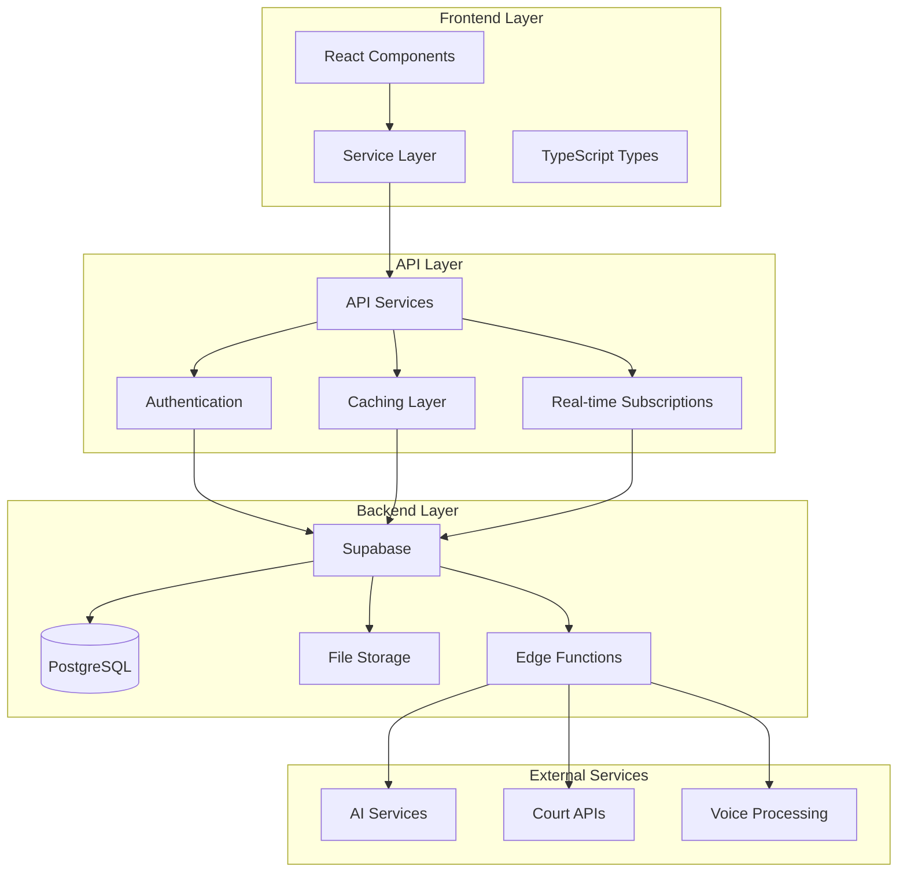
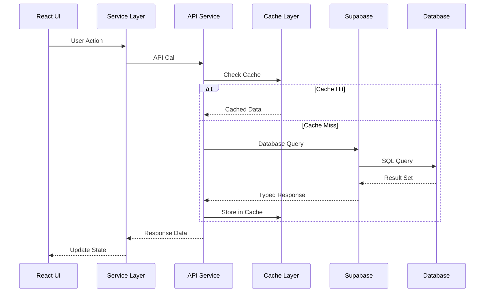
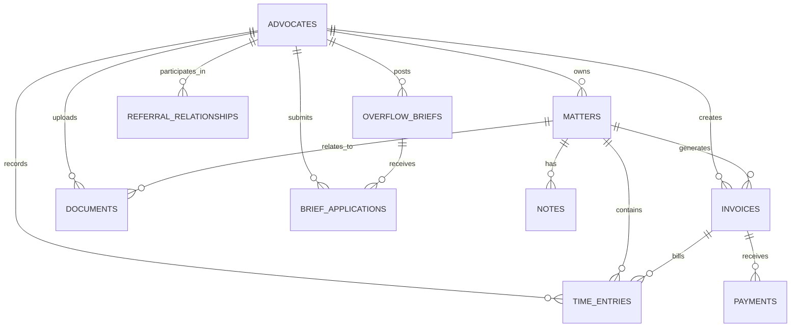

# Backend Integration Design

## Overview

This design document outlines the implementation of backend services and database integration for the lexo Legal Practice Management Platform. The system will connect existing frontend components to a Supabase backend, providing data persistence, real-time updates, and comprehensive API services.

## Architecture

### High-Level Architecture



### Data Flow Architecture



## Components and Interfaces

### 1. Authentication System

#### Supabase Auth Integration
```typescript
interface AuthService {
  signIn(email: string, password: string): Promise<AuthResponse>;
  signUp(email: string, password: string, metadata: UserMetadata): Promise<AuthResponse>;
  signOut(): Promise<void>;
  getCurrentUser(): Promise<User | null>;
  refreshSession(): Promise<Session | null>;
  onAuthStateChange(callback: (event: AuthChangeEvent, session: Session | null) => void): void;
}

interface UserMetadata {
  full_name: string;
  practice_number: string;
  bar: 'johannesburg' | 'cape_town';
  specialisations: string[];
}
```

#### Row Level Security (RLS) Implementation
- All tables will have RLS enabled
- Policies will ensure advocates can only access their own data
- Shared data (like overflow briefs) will have specific visibility rules
- Admin functions will use service role for elevated access

### 2. Practice Growth & Referral Engine

#### Overflow Brief Management
```typescript
interface OverflowBriefService {
  createBrief(brief: CreateOverflowBriefRequest): Promise<OverflowBrief>;
  getAvailableBriefs(filters: BriefFilters): Promise<OverflowBrief[]>;
  applyForBrief(briefId: string, application: BriefApplication): Promise<void>;
  reviewApplications(briefId: string): Promise<BriefApplication[]>;
  acceptApplication(applicationId: string): Promise<void>;
  declineApplication(applicationId: string, reason: string): Promise<void>;
}

interface BriefFilters {
  category?: SpecialisationCategory;
  bar?: BarAssociation;
  feeRange?: { min: number; max: number };
  urgency?: boolean;
  search?: string;
}
```

#### Referral Tracking System
```typescript
interface ReferralService {
  recordReferral(referral: ReferralRecord): Promise<void>;
  getReferralStats(advocateId: string): Promise<ReferralStats>;
  getReciprocityAnalysis(advocateId: string): Promise<ReciprocityAnalysis>;
  updateReferralRelationship(fromId: string, toId: string, value: number): Promise<void>;
}

interface ReferralStats {
  given: number;
  received: number;
  valueGiven: number;
  valueReceived: number;
  reciprocityRatio: number;
  topReferralPartners: ReferralPartner[];
}
```

### 3. Document Intelligence System

#### Document Upload and Storage
```typescript
interface DocumentService {
  uploadDocument(file: File, matterId: string, metadata: DocumentMetadata): Promise<Document>;
  analyzeDocument(documentId: string): Promise<DocumentAnalysis>;
  searchDocuments(query: string, filters: DocumentFilters): Promise<Document[]>;
  generateFeeNarrative(timeEntries: TimeEntry[], options: NarrativeOptions): Promise<GeneratedNarrative>;
  searchPrecedents(query: PrecedentSearchQuery): Promise<PrecedentDocument[]>;
}

interface DocumentAnalysis {
  extractedText: string;
  keyDates: Date[];
  parties: string[];
  issues: string[];
  deliverables: string[];
  confidence: number;
  suggestedMatterData: Partial<Matter>;
}
```

#### AI Integration for Document Processing
- Supabase Edge Functions will handle AI processing
- Integration with OpenAI/Claude for text analysis
- Custom prompts for legal document understanding
- Fallback mechanisms for AI service failures

### 4. Strategic Finance System

#### Cash Flow Management
```typescript
interface CashFlowService {
  generateForecast(advocateId: string, period: ForecastPeriod): Promise<CashFlowForecast>;
  analyzeSeasonalPatterns(advocateId: string): Promise<SeasonalPattern[]>;
  getCollectionAnalysis(advocateId: string): Promise<CollectionAnalysis>;
  generateAlerts(advocateId: string): Promise<CashFlowAlert[]>;
  optimizeCashFlow(advocateId: string): Promise<OptimizationStrategy[]>;
}

interface CashFlowForecast {
  period: ForecastPeriod;
  projections: CashFlowProjection[];
  confidence: number;
  scenarios: CashFlowScenario[];
  recommendations: string[];
}
```

#### Fee Optimization Engine
```typescript
interface FeeOptimizationService {
  analyzeFeeStructure(matterId: string): Promise<FeeAnalysis>;
  recommendOptimalPricing(matter: Matter, marketData: MarketData): Promise<PricingRecommendation>;
  calculateSuccessFeeScenarios(matter: Matter, scenarios: SuccessScenario[]): Promise<SuccessFeeAnalysis>;
  getMarketBenchmarks(category: string, bar: string): Promise<MarketBenchmarks>;
}
```

### 5. Workflow & Integration System

#### Court Integration
```typescript
interface CourtIntegrationService {
  syncCourtDiary(advocateId: string): Promise<CourtDate[]>;
  getJudgeAnalytics(judgeId: string): Promise<JudgeAnalytics>;
  searchCourtRecords(query: CourtSearchQuery): Promise<CourtRecord[]>;
  subscribeToCourtUpdates(matterId: string): Promise<void>;
}

interface JudgeAnalytics {
  judgeId: string;
  averageHearingDuration: number;
  preferredArgumentStyle: string;
  settlementRate: number;
  commonRulings: string[];
  anonymizedInsights: string[];
}
```

#### Voice Query Processing
```typescript
interface VoiceQueryService {
  processVoiceQuery(audioBlob: Blob): Promise<QueryResponse>;
  executeQuery(query: ParsedQuery): Promise<QueryResult>;
  getSupportedQueries(): Promise<QueryTemplate[]>;
}

interface ParsedQuery {
  intent: string;
  entities: Record<string, any>;
  parameters: Record<string, any>;
  confidence: number;
}
```

### 6. The Academy System

#### Training and Development
```typescript
interface AcademyService {
  getVirtualShadowingScenarios(): Promise<ShadowingScenario[]>;
  submitForPeerReview(workId: string, reviewers: string[]): Promise<ReviewRequest>;
  providePeerReview(requestId: string, review: PeerReview): Promise<void>;
  trackCPDCredits(advocateId: string, activity: CPDActivity): Promise<void>;
  getCPDSummary(advocateId: string): Promise<CPDSummary>;
  getSuccessionPlanningTools(): Promise<SuccessionTool[]>;
}

interface ShadowingScenario {
  id: string;
  title: string;
  description: string;
  difficulty: 'beginner' | 'intermediate' | 'advanced';
  estimatedDuration: number;
  learningObjectives: string[];
  scenario: VirtualScenario;
}
```

### 7. Enhanced Compliance System

#### Trust Account Auditing
```typescript
interface ComplianceService {
  auditTrustAccount(advocateId: string): Promise<AuditResult>;
  generateAuditTrail(advocateId: string, dateRange: DateRange): Promise<AuditTrail>;
  checkEthicsCompliance(context: EthicsCheckContext): Promise<EthicsViolation[]>;
  getComplianceScore(advocateId: string): Promise<ComplianceScore>;
  updateComplianceRules(rules: ComplianceRule[]): Promise<void>;
}

interface AuditResult {
  status: 'compliant' | 'warning' | 'violation';
  findings: AuditFinding[];
  recommendations: string[];
  nextAuditDate: Date;
}
```

## Data Models

### Core Entity Relationships



### Database Schema Enhancements

#### Indexing Strategy
```sql
-- Performance indexes for common queries
CREATE INDEX CONCURRENTLY idx_matters_advocate_status ON matters(advocate_id, status) WHERE deleted_at IS NULL;
CREATE INDEX CONCURRENTLY idx_invoices_status_due ON invoices(status, due_date) WHERE deleted_at IS NULL;
CREATE INDEX CONCURRENTLY idx_time_entries_matter_unbilled ON time_entries(matter_id) WHERE billed = false AND deleted_at IS NULL;
CREATE INDEX CONCURRENTLY idx_documents_content_search ON documents USING GIN(content_vector);
CREATE INDEX CONCURRENTLY idx_overflow_briefs_available ON overflow_briefs(category, bar) WHERE status = 'available';

-- Partial indexes for specific use cases
CREATE INDEX CONCURRENTLY idx_overdue_invoices ON invoices(due_date) WHERE status IN ('sent', 'viewed') AND due_date < CURRENT_DATE;
CREATE INDEX CONCURRENTLY idx_active_matters_completion ON matters(expected_completion_date) WHERE status IN ('active', 'pending');
```

#### Materialized Views for Performance
```sql
-- Advocate dashboard summary
CREATE MATERIALIZED VIEW advocate_dashboard_summary AS
SELECT 
  a.id as advocate_id,
  COUNT(DISTINCT m.id) FILTER (WHERE m.status IN ('active', 'pending')) as active_matters,
  SUM(m.wip_value) as total_wip,
  COUNT(DISTINCT i.id) FILTER (WHERE i.status = 'overdue') as overdue_invoices,
  SUM(i.balance_due) FILTER (WHERE i.status IN ('sent', 'viewed', 'overdue')) as outstanding_amount
FROM advocates a
LEFT JOIN matters m ON a.id = m.advocate_id AND m.deleted_at IS NULL
LEFT JOIN invoices i ON a.id = i.advocate_id AND i.deleted_at IS NULL
WHERE a.deleted_at IS NULL
GROUP BY a.id;

-- Refresh strategy
CREATE OR REPLACE FUNCTION refresh_dashboard_summary()
RETURNS void AS $
BEGIN
  REFRESH MATERIALIZED VIEW CONCURRENTLY advocate_dashboard_summary;
END;
$ LANGUAGE plpgsql;
```

## Error Handling

### Error Classification System

```typescript
enum ErrorType {
  VALIDATION_ERROR = 'VALIDATION_ERROR',
  AUTHENTICATION_ERROR = 'AUTHENTICATION_ERROR',
  AUTHORIZATION_ERROR = 'AUTHORIZATION_ERROR',
  NOT_FOUND_ERROR = 'NOT_FOUND_ERROR',
  CONFLICT_ERROR = 'CONFLICT_ERROR',
  EXTERNAL_SERVICE_ERROR = 'EXTERNAL_SERVICE_ERROR',
  DATABASE_ERROR = 'DATABASE_ERROR',
  UNKNOWN_ERROR = 'UNKNOWN_ERROR'
}

interface ApiError {
  type: ErrorType;
  message: string;
  details?: Record<string, any>;
  code?: string;
  timestamp: Date;
  requestId: string;
}
```

### Error Handling Strategy

1. **Client-Side Error Boundaries**: React error boundaries to catch and display user-friendly errors
2. **API Error Interceptors**: Axios interceptors to handle common error scenarios
3. **Retry Logic**: Automatic retry for transient failures with exponential backoff
4. **Fallback Mechanisms**: Graceful degradation when services are unavailable
5. **Error Logging**: Comprehensive error logging for debugging and monitoring

## Testing Strategy

### Unit Testing
- Jest for service layer testing
- Mock Supabase client for isolated testing
- Test coverage targets: 80% for services, 60% for components

### Integration Testing
- Supabase local development environment
- Test database with realistic sample data
- API endpoint testing with Supertest

### End-to-End Testing
- Playwright for critical user journeys
- Test scenarios covering main workflows
- Automated testing in CI/CD pipeline

### Performance Testing
- Load testing for database queries
- Stress testing for file uploads
- Monitoring for query performance regression

## Security Considerations

### Data Protection
- Row Level Security (RLS) for all sensitive data
- Encrypted storage for sensitive documents
- Audit logging for all data access and modifications
- GDPR compliance for data handling

### Authentication & Authorization
- JWT token-based authentication
- Role-based access control (RBAC)
- Session management with automatic refresh
- Multi-factor authentication support

### API Security
- Rate limiting to prevent abuse
- Input validation and sanitization
- SQL injection prevention through parameterized queries
- CORS configuration for secure cross-origin requests

## Performance Optimization

### Caching Strategy
```typescript
interface CacheConfig {
  ttl: number; // Time to live in seconds
  staleWhileRevalidate: boolean;
  tags: string[]; // For cache invalidation
}

const cacheConfigs: Record<string, CacheConfig> = {
  'advocate-profile': { ttl: 3600, staleWhileRevalidate: true, tags: ['advocate'] },
  'matter-list': { ttl: 300, staleWhileRevalidate: true, tags: ['matters'] },
  'dashboard-stats': { ttl: 600, staleWhileRevalidate: true, tags: ['dashboard'] },
  'precedent-search': { ttl: 1800, staleWhileRevalidate: false, tags: ['precedents'] }
};
```

### Database Optimization
- Connection pooling for efficient database connections
- Query optimization with proper indexing
- Materialized views for complex aggregations
- Partitioning for large tables (audit logs, time entries)

### Real-time Updates
- Supabase real-time subscriptions for live data
- Selective subscriptions to minimize bandwidth
- Optimistic updates for better user experience
- Conflict resolution for concurrent modifications

## Deployment and Monitoring

### Environment Configuration
```typescript
interface EnvironmentConfig {
  supabase: {
    url: string;
    anonKey: string;
    serviceRoleKey: string;
  };
  ai: {
    openaiApiKey: string;
    claudeApiKey: string;
  };
  external: {
    courtApiUrl: string;
    voiceServiceUrl: string;
  };
}
```

### Monitoring and Observability
- Application performance monitoring (APM)
- Database query performance tracking
- Error rate and response time monitoring
- User behavior analytics
- System health checks and alerts

This design provides a comprehensive foundation for implementing the backend integration while maintaining the existing frontend architecture and ensuring scalability, security, and performance.