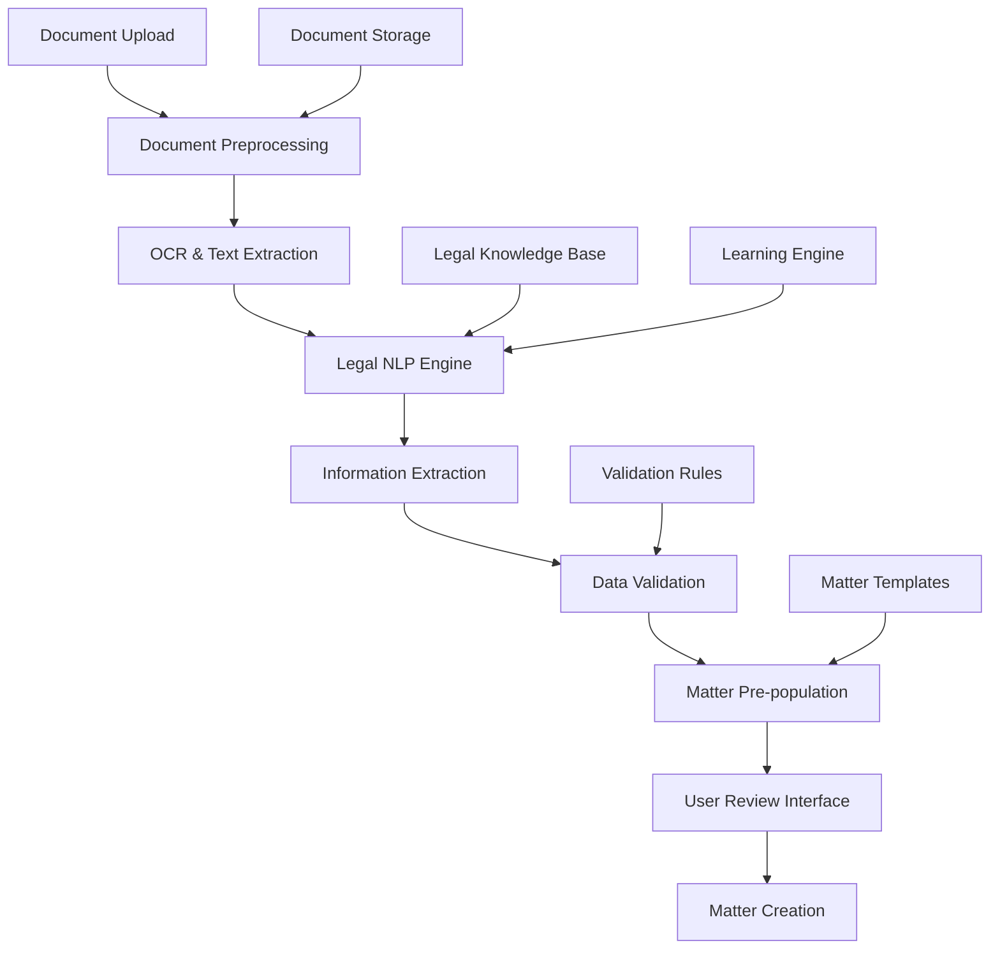

# Brief Analysis AI - Design Document

## Overview

The Brief Analysis AI system leverages advanced document processing, optical character recognition (OCR), and legal-specific natural language processing to automatically extract structured information from legal documents. The system uses a multi-stage pipeline that processes documents, extracts key information, validates data, and integrates with the matter management system.

## Architecture

### High-Level Architecture



### Component Architecture

The system consists of several specialized components:

1. **Document Processing Pipeline**: Handles file upload, preprocessing, and text extraction
2. **Legal NLP Engine**: Specialized AI for legal document understanding
3. **Information Extraction Service**: Extracts structured data from processed text
4. **Validation Engine**: Validates and scores extracted information
5. **Matter Integration Service**: Maps extracted data to matter management system
6. **Learning and Feedback System**: Improves accuracy through user corrections

## Components and Interfaces

### 1. Document Processing Components

#### DocumentUploadModal
```typescript
interface DocumentUploadModalProps {
  isOpen: boolean;
  onClose: () => void;
  onUploadComplete: (analysis: DocumentAnalysis) => void;
  matterId?: string; // For adding to existing matter
  acceptedTypes: string[];
  maxFileSize: number;
}

interface DocumentAnalysis {
  id: string;
  documentId: string;
  fileName: string;
  fileType: string;
  processingStatus: 'uploading' | 'processing' | 'completed' | 'error';
  extractedData: ExtractedLegalData;
  confidence: number;
  processingTime: number;
  createdAt: Date;
}
```

#### DocumentAnalysisViewer
```typescript
interface DocumentAnalysisViewerProps {
  analysis: DocumentAnalysis;
  onEdit: (field: string, value: any) => void;
  onApprove: (analysis: DocumentAnalysis) => void;
  onReject: (analysis: DocumentAnalysis) => void;
  onCreateMatter: (data: ExtractedLegalData) => void;
}

interface ExtractedLegalData {
  documentType: DocumentType;
  parties: Party[];
  keyDates: KeyDate[];
  amounts: MonetaryAmount[];
  legalReferences: LegalReference[];
  deliverables: Deliverable[];
  jurisdiction: Jurisdiction;
  practiceAreas: string[];
  urgency: UrgencyLevel;
  summary: string;
  confidence: ConfidenceScores;
}
```

### 2. Document Processing Pipeline

#### DocumentProcessor
```typescript
class DocumentProcessor {
  async processDocument(file: File): Promise<DocumentAnalysis>;
  async extractText(file: File): Promise<TextExtractionResult>;
  async preprocessDocument(file: File): Promise<PreprocessedDocument>;
  async validateDocument(file: File): Promise<ValidationResult>;
}

interface TextExtractionResult {
  text: string;
  pages: PageContent[];
  metadata: DocumentMetadata;
  ocrConfidence: number;
  language: string;
}

interface PreprocessedDocument {
  cleanedText: string;
  structure: DocumentStructure;
  formatting: FormattingInfo;
  images: ExtractedImage[];
}
```

#### OCRService
```typescript
interface OCRService {
  extractText(file: File): Promise<TextExtractionResult>;
  extractTables(file: File): Promise<TableData[]>;
  extractImages(file: File): Promise<ExtractedImage[]>;
  getDocumentLayout(file: File): Promise<LayoutAnalysis>;
}

interface TableData {
  headers: string[];
  rows: string[][];
  position: BoundingBox;
  confidence: number;
}

interface ExtractedImage {
  id: string;
  type: 'signature' | 'diagram' | 'photo' | 'logo';
  position: BoundingBox;
  base64Data: string;
  description?: string;
}
```

### 3. Legal NLP Engine

#### LegalNLPProcessor
```typescript
class LegalNLPProcessor {
  async analyzeDocument(text: string, metadata: DocumentMetadata): Promise<ExtractedLegalData>;
  async classifyDocumentType(text: string): Promise<DocumentClassification>;
  async extractParties(text: string): Promise<Party[]>;
  async extractDates(text: string): Promise<KeyDate[]>;
  async extractLegalReferences(text: string): Promise<LegalReference[]>;
  async extractAmounts(text: string): Promise<MonetaryAmount[]>;
  async identifyDeliverables(text: string): Promise<Deliverable[]>;
  async assessUrgency(text: string, dates: KeyDate[]): Promise<UrgencyLevel>;
}

interface DocumentClassification {
  primaryType: DocumentType;
  subType?: string;
  confidence: number;
  alternativeTypes: Array<{ type: DocumentType; confidence: number }>;
}

enum DocumentType {
  PLEADING = 'pleading',
  MOTION = 'motion',
  CONTRACT = 'contract',
  CORRESPONDENCE = 'correspondence',
  DISCOVERY = 'discovery',
  BRIEF = 'brief',
  ORDER = 'order',
  JUDGMENT = 'judgment',
  AGREEMENT = 'agreement',
  NOTICE = 'notice'
}
```

### 4. Information Extraction Models

#### Party Extraction
```typescript
interface Party {
  id: string;
  name: string;
  type: PartyType;
  role: PartyRole;
  contact?: ContactInfo;
  attorney?: AttorneyInfo;
  confidence: number;
  textPosition: TextPosition;
}

enum PartyType {
  INDIVIDUAL = 'individual',
  CORPORATION = 'corporation',
  GOVERNMENT = 'government',
  ORGANIZATION = 'organization'
}

enum PartyRole {
  PLAINTIFF = 'plaintiff',
  DEFENDANT = 'defendant',
  APPLICANT = 'applicant',
  RESPONDENT = 'respondent',
  WITNESS = 'witness',
  ATTORNEY = 'attorney',
  THIRD_PARTY = 'third_party'
}
```

#### Date and Deadline Extraction
```typescript
interface KeyDate {
  id: string;
  date: Date;
  type: DateType;
  description: string;
  importance: ImportanceLevel;
  confidence: number;
  textPosition: TextPosition;
  relatedParties?: string[];
}

enum DateType {
  FILING_DEADLINE = 'filing_deadline',
  HEARING_DATE = 'hearing_date',
  DISCOVERY_DEADLINE = 'discovery_deadline',
  TRIAL_DATE = 'trial_date',
  CONTRACT_DATE = 'contract_date',
  INCIDENT_DATE = 'incident_date',
  NOTICE_DATE = 'notice_date',
  EFFECTIVE_DATE = 'effective_date'
}

enum ImportanceLevel {
  CRITICAL = 'critical',
  HIGH = 'high',
  MEDIUM = 'medium',
  LOW = 'low'
}
```

#### Legal Reference Extraction
```typescript
interface LegalReference {
  id: string;
  type: ReferenceType;
  citation: string;
  title?: string;
  jurisdiction?: string;
  year?: number;
  relevance: RelevanceLevel;
  confidence: number;
  textPosition: TextPosition;
}

enum ReferenceType {
  CASE_LAW = 'case_law',
  STATUTE = 'statute',
  REGULATION = 'regulation',
  CONSTITUTION = 'constitution',
  TREATY = 'treaty',
  SECONDARY_SOURCE = 'secondary_source'
}
```

### 5. Validation Engine

#### DataValidator
```typescript
class DataValidator {
  async validateExtractedData(data: ExtractedLegalData): Promise<ValidationResult>;
  async validateDates(dates: KeyDate[]): Promise<DateValidation[]>;
  async validateParties(parties: Party[]): Promise<PartyValidation[]>;
  async validateAmounts(amounts: MonetaryAmount[]): Promise<AmountValidation[]>;
  async validateReferences(references: LegalReference[]): Promise<ReferenceValidation[]>;
}

interface ValidationResult {
  isValid: boolean;
  confidence: number;
  warnings: ValidationWarning[];
  errors: ValidationError[];
  suggestions: ValidationSuggestion[];
}

interface ValidationWarning {
  field: string;
  message: string;
  severity: 'low' | 'medium' | 'high';
  suggestion?: string;
}
```

### 6. Matter Integration Service

#### MatterPrePopulationService
```typescript
class MatterPrePopulationService {
  async createMatterFromAnalysis(analysis: DocumentAnalysis): Promise<PrePopulatedMatter>;
  async mapPartiesToMatterFields(parties: Party[]): Promise<MatterPartyMapping>;
  async createCalendarEntries(dates: KeyDate[]): Promise<CalendarEntry[]>;
  async generateMatterDescription(data: ExtractedLegalData): Promise<string>;
  async suggestMatterType(classification: DocumentClassification): Promise<string>;
}

interface PrePopulatedMatter {
  title: string;
  clientName: string;
  opposingParty?: string;
  matterType: string;
  jurisdiction: string;
  description: string;
  estimatedValue?: number;
  keyDates: CalendarEntry[];
  documents: DocumentReference[];
  tags: string[];
  riskLevel: RiskLevel;
}
```

## Data Models

### Document Analysis Storage
```sql
CREATE TABLE document_analyses (
  id UUID PRIMARY KEY DEFAULT gen_random_uuid(),
  user_id UUID NOT NULL REFERENCES auth.users(id),
  matter_id UUID REFERENCES matters(id),
  document_id UUID NOT NULL,
  file_name VARCHAR(255) NOT NULL,
  file_type VARCHAR(50) NOT NULL,
  file_size BIGINT NOT NULL,
  processing_status VARCHAR(20) DEFAULT 'pending',
  extracted_data JSONB,
  confidence_scores JSONB,
  validation_results JSONB,
  processing_time_ms INTEGER,
  created_at TIMESTAMPTZ DEFAULT NOW(),
  completed_at TIMESTAMPTZ,
  reviewed_by UUID REFERENCES auth.users(id),
  reviewed_at TIMESTAMPTZ
);

CREATE INDEX idx_document_analyses_user_id ON document_analyses(user_id);
CREATE INDEX idx_document_analyses_matter_id ON document_analyses(matter_id);
CREATE INDEX idx_document_analyses_status ON document_analyses(processing_status);
```

### Extracted Entities Storage
```sql
CREATE TABLE extracted_entities (
  id UUID PRIMARY KEY DEFAULT gen_random_uuid(),
  analysis_id UUID NOT NULL REFERENCES document_analyses(id),
  entity_type VARCHAR(50) NOT NULL,
  entity_data JSONB NOT NULL,
  confidence DECIMAL(3,2) NOT NULL,
  text_position JSONB,
  validated BOOLEAN DEFAULT false,
  user_corrected BOOLEAN DEFAULT false,
  created_at TIMESTAMPTZ DEFAULT NOW()
);

CREATE INDEX idx_extracted_entities_analysis_id ON extracted_entities(analysis_id);
CREATE INDEX idx_extracted_entities_type ON extracted_entities(entity_type);
```

### Learning and Feedback Storage
```sql
CREATE TABLE extraction_feedback (
  id UUID PRIMARY KEY DEFAULT gen_random_uuid(),
  analysis_id UUID NOT NULL REFERENCES document_analyses(id),
  entity_id UUID REFERENCES extracted_entities(id),
  user_id UUID NOT NULL REFERENCES auth.users(id),
  feedback_type VARCHAR(20) NOT NULL, -- 'correction', 'approval', 'rejection'
  original_value JSONB,
  corrected_value JSONB,
  feedback_notes TEXT,
  created_at TIMESTAMPTZ DEFAULT NOW()
);
```

## Error Handling

### Document Processing Errors
- **File Format Unsupported**: Clear error message with supported format list
- **File Too Large**: Size limit notification with compression suggestions
- **OCR Failure**: Fallback to manual text input with partial results
- **Malware Detection**: Security warning with safe handling instructions

### AI Processing Errors
- **Low Confidence Extraction**: Highlight uncertain fields for manual review
- **Service Unavailable**: Queue for retry with user notification
- **Timeout Errors**: Partial results with option to continue processing
- **Rate Limiting**: Queue management with estimated processing time

### Validation Errors
- **Date Inconsistencies**: Flag impossible dates with correction suggestions
- **Party Conflicts**: Highlight conflicting party information
- **Reference Errors**: Invalid citations with format correction suggestions
- **Amount Discrepancies**: Currency and calculation validation warnings

## Testing Strategy

### Unit Tests
- Document preprocessing and text extraction
- NLP entity extraction accuracy with legal document samples
- Validation rule enforcement and error detection
- Matter pre-population mapping logic

### Integration Tests
- End-to-end document upload to matter creation workflow
- AI service integration and error handling
- Database operations and data integrity
- User interface responsiveness with large documents

### Accuracy Tests
- Legal document type classification accuracy
- Entity extraction precision and recall metrics
- Validation rule effectiveness
- User correction learning effectiveness

### Performance Tests
- Large document processing times
- Concurrent document processing capacity
- Memory usage optimization
- API response time benchmarks

## Security Considerations

### Document Security
- Encrypted file storage with access controls
- Secure document transmission with signed URLs
- Automatic document deletion after retention period
- Audit logging for all document access

### AI Processing Security
- Data residency compliance for AI services
- Anonymization of sensitive data for processing
- Secure API communication with AI providers
- Model training data privacy protection

### Access Control
- Matter-level permissions for document analysis
- Role-based access to analysis features
- User authentication for all operations
- Secure sharing of analysis results

## Implementation Phases

### Phase 1: Core Document Processing
- Implement document upload and preprocessing
- Set up OCR and text extraction services
- Create basic document analysis storage
- Build document viewer and management interface

### Phase 2: Legal NLP Integration
- Integrate legal-specific NLP services
- Implement entity extraction for parties, dates, and amounts
- Add document classification capabilities
- Create validation and confidence scoring

### Phase 3: Matter Integration
- Build matter pre-population from extracted data
- Create user review and editing interface
- Implement calendar integration for key dates
- Add document-to-matter linking functionality

### Phase 4: Advanced Features and Learning
- Implement learning from user corrections
- Add document comparison and relationship detection
- Create advanced validation rules
- Build analytics and reporting for extraction accuracy