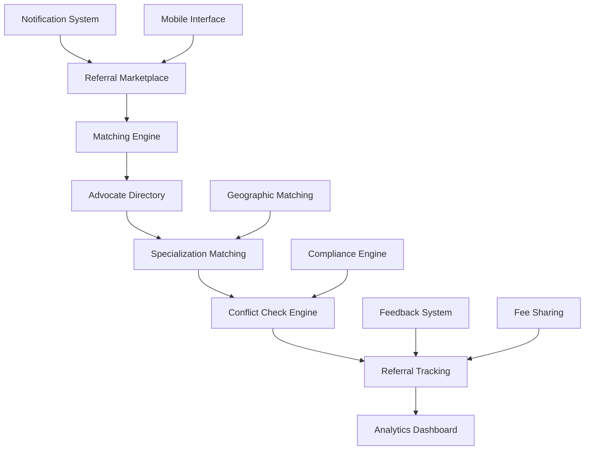

# Practice Growth & Referral Engine - Design Document

## Overview

The Practice Growth & Referral Engine creates a sophisticated marketplace and networking platform for legal professionals. It combines intelligent matching algorithms, relationship tracking, compliance monitoring, and analytics to facilitate ethical and effective referral relationships within the South African legal community.

## Architecture

### High-Level Architecture



### Component Architecture

The system consists of several interconnected components:

1. **Referral Marketplace**: Central hub for posting and discovering referral opportunities
2. **Intelligent Matching Engine**: AI-powered system for connecting advocates with suitable matters
3. **Advocate Directory**: Comprehensive profiles with specializations and capabilities
4. **Relationship Tracking**: System for monitoring referral relationships and reciprocity
5. **Compliance Monitor**: Ensures all referrals comply with professional conduct rules
6. **Analytics and Reporting**: Insights into network performance and opportunities

## Components and Interfaces

### 1. Referral Marketplace Components

#### ReferralMarketplace
```typescript
interface ReferralMarketplaceProps {
  userRole: 'advocate' | 'chambers_admin';
  filters: ReferralFilters;
  onFilterChange: (filters: ReferralFilters) => void;
  onReferralPost: (referral: ReferralOpportunity) => void;
}

interface ReferralOpportunity {
  id: string;
  posterId: string;
  title: string;
  description: string;
  practiceArea: string;
  subSpecialization?: string;
  jurisdiction: string;
  estimatedValue: number;
  urgency: UrgencyLevel;
  requiredExperience: ExperienceLevel;
  conflictParties: string[];
  deadline?: Date;
  feeArrangement: FeeArrangement;
  status: ReferralStatus;
  createdAt: Date;
  expiresAt: Date;
}
```

#### ReferralCard
```typescript
interface ReferralCardProps {
  referral: ReferralOpportunity;
  currentUser: User;
  onExpress Interest: (referralId: string) => void;
  onViewDetails: (referralId: string) => void;
  matchScore?: number;
  conflictStatus?: ConflictCheckResult;
}

interface ConflictCheckResult {
  hasConflict: boolean;
  conflictType?: ConflictType;
  conflictDetails?: string;
  waivable: boolean;
  requiresDisclosure: boolean;
}
```

### 2. Advocate Directory and Profiles

#### AdvocateDirectory
```typescript
interface AdvocateDirectoryProps {
  searchFilters: DirectoryFilters;
  onSearch: (filters: DirectoryFilters) => void;
  onConnect: (advocateId: string) => void;
  onViewProfile: (advocateId: string) => void;
}

interface AdvocateProfile {
  id: string;
  userId: string;
  fullName: string;
  practiceNumber: string;
  chambers?: string;
  bar: Bar;
  yearAdmitted: number;
  specializations: Specialization[];
  languages: string[];
  jurisdictions: string[];
  availability: AvailabilityStatus;
  referralPreferences: ReferralPreferences;
  reputation: ReputationScore;
  networkStats: NetworkStatistics;
  contactInfo: ContactInformation;
}
```

#### SpecializationManager
```typescript
interface Specialization {
  id: string;
  practiceArea: string;
  subArea?: string;
  experienceLevel: ExperienceLevel;
  yearsExperience: number;
  certifications: string[];
  notableMatters: NotableMatter[];
  successRate?: number;
  averageMatterValue?: number;
  keywords: string[];
}

interface NotableMatter {
  id: string;
  title: string;
  year: number;
  outcome: string;
  value?: number;
  significance: string;
  confidential: boolean;
}
```

### 3. Matching Engine

#### IntelligentMatcher
```typescript
class IntelligentMatcher {
  async findMatches(referral: ReferralOpportunity): Promise<AdvocateMatch[]>;
  async scoreMatch(advocate: AdvocateProfile, referral: ReferralOpportunity): Promise<MatchScore>;
  async filterByAvailability(advocates: AdvocateProfile[]): Promise<AdvocateProfile[]>;
  async checkGeographicCompatibility(advocate: AdvocateProfile, jurisdiction: string): Promise<boolean>;
  async validateExperienceRequirements(advocate: AdvocateProfile, requirements: ExperienceRequirements): Promise<boolean>;
}

interface AdvocateMatch {
  advocate: AdvocateProfile;
  matchScore: number;
  matchReasons: MatchReason[];
  potentialConcerns: string[];
  estimatedAvailability: Date;
  feeCompatibility: boolean;
}

interface MatchScore {
  overall: number;
  specialization: number;
  experience: number;
  geographic: number;
  availability: number;
  reputation: number;
  relationship: number;
}
```

### 4. Relationship Tracking System

#### ReferralTracker
```typescript
class ReferralTracker {
  async trackReferral(referral: CompletedReferral): Promise<void>;
  async updateReferralStatus(referralId: string, status: ReferralStatus): Promise<void>;
  async calculateReciprocity(advocateId1: string, advocateId2: string): Promise<ReciprocityScore>;
  async generateNetworkAnalytics(advocateId: string): Promise<NetworkAnalytics>;
}

interface CompletedReferral {
  id: string;
  referringAdvocate: string;
  receivingAdvocate: string;
  matterId: string;
  referralDate: Date;
  acceptanceDate: Date;
  completionDate?: Date;
  outcome: ReferralOutcome;
  feeSharing: FeeSharing;
  feedback: ReferralFeedback;
}

interface ReciprocityScore {
  advocateId: string;
  partnerId: string;
  referralsGiven: number;
  referralsReceived: number;
  valueGiven: number;
  valueReceived: number;
  reciprocityRatio: number;
  relationshipHealth: HealthScore;
}
```

### 5. Conflict Check Engine

#### ConflictChecker
```typescript
class ConflictChecker {
  async checkConflicts(advocateId: string, referral: ReferralOpportunity): Promise<ConflictCheckResult>;
  async checkPartyConflicts(advocateId: string, parties: string[]): Promise<PartyConflict[]>;
  async checkMatterConflicts(advocateId: string, matterDetails: MatterDetails): Promise<MatterConflict[]>;
  async suggestConflictResolution(conflict: ConflictCheckResult): Promise<ResolutionSuggestion[]>;
}

interface PartyConflict {
  conflictingParty: string;
  conflictType: ConflictType;
  existingMatterId: string;
  severity: ConflictSeverity;
  waivable: boolean;
  disclosureRequired: boolean;
}

enum ConflictType {
  DIRECT_ADVERSE = 'direct_adverse',
  FORMER_CLIENT = 'former_client',
  RELATED_ENTITY = 'related_entity',
  CONFIDENTIAL_INFO = 'confidential_info',
  BUSINESS_INTEREST = 'business_interest'
}
```

### 6. Feedback and Reputation System

#### FeedbackManager
```typescript
class FeedbackManager {
  async submitFeedback(referralId: string, feedback: ReferralFeedback): Promise<void>;
  async calculateReputationScore(advocateId: string): Promise<ReputationScore>;
  async getFeedbackSummary(advocateId: string): Promise<FeedbackSummary>;
  async flagInappropriateFeedback(feedbackId: string, reason: string): Promise<void>;
}

interface ReferralFeedback {
  id: string;
  referralId: string;
  reviewerId: string;
  revieweeId: string;
  ratings: FeedbackRatings;
  comments: string;
  wouldReferAgain: boolean;
  anonymous: boolean;
  createdAt: Date;
}

interface FeedbackRatings {
  communication: number; // 1-5
  expertise: number; // 1-5
  professionalism: number; // 1-5
  timeliness: number; // 1-5
  overall: number; // 1-5
}

interface ReputationScore {
  advocateId: string;
  overallScore: number;
  totalReviews: number;
  averageRatings: FeedbackRatings;
  referralSuccessRate: number;
  responseTime: number;
  completionRate: number;
  lastUpdated: Date;
}
```

### 7. Analytics and Reporting

#### NetworkAnalytics
```typescript
class NetworkAnalytics {
  async generateNetworkReport(advocateId: string): Promise<NetworkReport>;
  async getMarketInsights(practiceArea: string): Promise<MarketInsights>;
  async trackReferralTrends(timeframe: TimeFrame): Promise<ReferralTrends>;
  async identifyGrowthOpportunities(advocateId: string): Promise<GrowthOpportunity[]>;
}

interface NetworkReport {
  advocateId: string;
  reportPeriod: DateRange;
  referralStats: ReferralStatistics;
  networkHealth: NetworkHealth;
  topPartners: PartnerAnalysis[];
  growthMetrics: GrowthMetrics;
  recommendations: string[];
}

interface ReferralStatistics {
  totalReferralsGiven: number;
  totalReferralsReceived: number;
  totalValueReferred: number;
  averageReferralValue: number;
  successRate: number;
  responseTime: number;
}
```

## Data Models

### Referral Opportunities Storage
```sql
CREATE TABLE referral_opportunities (
  id UUID PRIMARY KEY DEFAULT gen_random_uuid(),
  poster_id UUID NOT NULL REFERENCES auth.users(id),
  title VARCHAR(255) NOT NULL,
  description TEXT NOT NULL,
  practice_area VARCHAR(100) NOT NULL,
  sub_specialization VARCHAR(100),
  jurisdiction VARCHAR(100) NOT NULL,
  estimated_value DECIMAL(12,2),
  urgency VARCHAR(20) NOT NULL,
  required_experience VARCHAR(20) NOT NULL,
  conflict_parties JSONB,
  deadline DATE,
  fee_arrangement JSONB NOT NULL,
  status VARCHAR(20) DEFAULT 'active',
  created_at TIMESTAMPTZ DEFAULT NOW(),
  expires_at TIMESTAMPTZ NOT NULL,
  updated_at TIMESTAMPTZ DEFAULT NOW()
);

CREATE INDEX idx_referral_opportunities_practice_area ON referral_opportunities(practice_area);
CREATE INDEX idx_referral_opportunities_jurisdiction ON referral_opportunities(jurisdiction);
CREATE INDEX idx_referral_opportunities_status ON referral_opportunities(status);
```

### Advocate Profiles Storage
```sql
CREATE TABLE advocate_profiles (
  id UUID PRIMARY KEY DEFAULT gen_random_uuid(),
  user_id UUID NOT NULL REFERENCES auth.users(id) UNIQUE,
  practice_number VARCHAR(50) NOT NULL UNIQUE,
  chambers VARCHAR(255),
  bar VARCHAR(50) NOT NULL,
  year_admitted INTEGER NOT NULL,
  specializations JSONB NOT NULL DEFAULT '[]',
  languages JSONB NOT NULL DEFAULT '[]',
  jurisdictions JSONB NOT NULL DEFAULT '[]',
  availability_status VARCHAR(20) DEFAULT 'available',
  referral_preferences JSONB NOT NULL DEFAULT '{}',
  contact_info JSONB NOT NULL DEFAULT '{}',
  created_at TIMESTAMPTZ DEFAULT NOW(),
  updated_at TIMESTAMPTZ DEFAULT NOW()
);

CREATE INDEX idx_advocate_profiles_user_id ON advocate_profiles(user_id);
CREATE INDEX idx_advocate_profiles_bar ON advocate_profiles(bar);
CREATE INDEX idx_advocate_profiles_chambers ON advocate_profiles(chambers);
```

### Referral Tracking Storage
```sql
CREATE TABLE referral_relationships (
  id UUID PRIMARY KEY DEFAULT gen_random_uuid(),
  referral_opportunity_id UUID NOT NULL REFERENCES referral_opportunities(id),
  referring_advocate_id UUID NOT NULL REFERENCES auth.users(id),
  receiving_advocate_id UUID NOT NULL REFERENCES auth.users(id),
  matter_id UUID REFERENCES matters(id),
  status VARCHAR(20) NOT NULL DEFAULT 'pending',
  referral_date TIMESTAMPTZ DEFAULT NOW(),
  acceptance_date TIMESTAMPTZ,
  completion_date TIMESTAMPTZ,
  outcome VARCHAR(50),
  fee_sharing JSONB,
  created_at TIMESTAMPTZ DEFAULT NOW(),
  updated_at TIMESTAMPTZ DEFAULT NOW()
);

CREATE INDEX idx_referral_relationships_referring ON referral_relationships(referring_advocate_id);
CREATE INDEX idx_referral_relationships_receiving ON referral_relationships(receiving_advocate_id);
CREATE INDEX idx_referral_relationships_status ON referral_relationships(status);
```

### Feedback and Reputation Storage
```sql
CREATE TABLE referral_feedback (
  id UUID PRIMARY KEY DEFAULT gen_random_uuid(),
  referral_relationship_id UUID NOT NULL REFERENCES referral_relationships(id),
  reviewer_id UUID NOT NULL REFERENCES auth.users(id),
  reviewee_id UUID NOT NULL REFERENCES auth.users(id),
  ratings JSONB NOT NULL,
  comments TEXT,
  would_refer_again BOOLEAN NOT NULL,
  anonymous BOOLEAN DEFAULT false,
  created_at TIMESTAMPTZ DEFAULT NOW()
);

CREATE INDEX idx_referral_feedback_reviewee ON referral_feedback(reviewee_id);
CREATE INDEX idx_referral_feedback_referral ON referral_feedback(referral_relationship_id);
```

## Error Handling

### Matching Engine Errors
- **No Matches Found**: Suggest broadening criteria or posting to general marketplace
- **Insufficient Data**: Request more detailed specialization information
- **Service Unavailable**: Queue matching requests for retry
- **Conflict Detection Failure**: Manual conflict check requirement

### Referral Process Errors
- **Expired Opportunities**: Automatic cleanup with notification to poster
- **Acceptance Conflicts**: First-come-first-served with waitlist options
- **Communication Failures**: Fallback to email and SMS notifications
- **Fee Arrangement Disputes**: Mediation workflow with professional conduct guidance

### Compliance Errors
- **Professional Conduct Violations**: Immediate suspension with review process
- **Unauthorized Fee Sharing**: Warning and education with compliance monitoring
- **Confidentiality Breaches**: Incident reporting and investigation procedures
- **Advertising Violations**: Content moderation and correction requirements

## Testing Strategy

### Unit Tests
- Matching algorithm accuracy with various advocate profiles
- Conflict detection logic with complex party relationships
- Reputation calculation with different feedback scenarios
- Fee sharing calculations with various arrangements

### Integration Tests
- End-to-end referral workflow from posting to completion
- Cross-system integration with matter management
- Notification system reliability and delivery
- Mobile application synchronization

### User Acceptance Tests
- Advocate onboarding and profile creation
- Referral posting and matching experience
- Feedback submission and reputation display
- Analytics dashboard usability and accuracy

### Compliance Tests
- Professional conduct rule enforcement
- Data privacy and confidentiality protection
- Fee sharing compliance validation
- Audit trail completeness and accuracy

## Security Considerations

### Data Protection
- Encrypted storage of all referral and profile data
- Secure communication channels for sensitive information
- Access controls based on professional relationships
- Audit logging for all system interactions

### Professional Confidentiality
- Matter-level access controls for referral details
- Anonymous feedback options with identity protection
- Secure document sharing for referral materials
- Confidentiality agreements for system usage

### Compliance Monitoring
- Automated detection of potential professional conduct violations
- Regular compliance audits and reporting
- Integration with professional conduct databases
- Incident response procedures for violations

## Implementation Phases

### Phase 1: Core Referral Marketplace
- Implement basic referral posting and browsing
- Create advocate profile management
- Build simple matching based on practice areas
- Add basic notification system

### Phase 2: Intelligent Matching and Tracking
- Implement AI-powered matching algorithms
- Add conflict checking integration
- Create referral relationship tracking
- Build reciprocity monitoring dashboard

### Phase 3: Advanced Features and Analytics
- Add feedback and reputation system
- Implement comprehensive analytics and reporting
- Create mobile application interface
- Add chambers and group management features

### Phase 4: Compliance and Professional Integration
- Implement full professional conduct compliance
- Add integration with Bar Council systems
- Create advanced conflict checking
- Build comprehensive audit and reporting capabilities