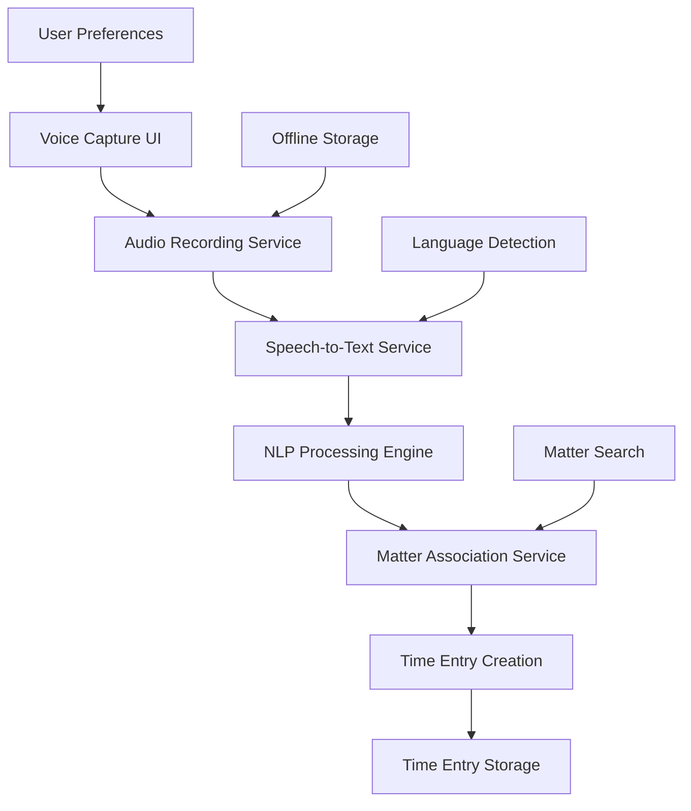

# Voice-First Time Capture - Design Document

## Overview

The Voice-First Time Capture system provides a seamless voice-to-time-entry workflow using modern web APIs and cloud-based speech recognition. The system captures audio, transcribes it using AI services, processes the natural language to extract structured data, and creates time entries with minimal user intervention.

## Architecture

### High-Level Architecture



### Component Architecture

The system consists of several key components:

1. **Voice Capture Interface**: React components for recording and managing voice notes
2. **Audio Processing Service**: Handles recording, storage, and transcription coordination
3. **Natural Language Processor**: Extracts structured data from transcribed text
4. **Matter Association Engine**: Links voice notes to appropriate matters
5. **Offline Sync Manager**: Handles offline recording and synchronization

## Components and Interfaces

### 1. Voice Capture Components

#### VoiceRecordingModal
```typescript
interface VoiceRecordingModalProps {
  isOpen: boolean;
  onClose: () => void;
  onRecordingComplete: (recording: VoiceRecording) => void;
  matterId?: string; // Pre-selected matter
}

interface VoiceRecording {
  id: string;
  audioBlob: Blob;
  duration: number;
  timestamp: Date;
  matterId?: string;
  transcription?: string;
  processingStatus: 'pending' | 'processing' | 'completed' | 'error';
}
```

#### VoiceNotesList
```typescript
interface VoiceNotesListProps {
  recordings: VoiceRecording[];
  onPlayback: (recordingId: string) => void;
  onEdit: (recordingId: string) => void;
  onDelete: (recordingId: string) => void;
  onConvertToTimeEntry: (recordingId: string) => void;
}
```

#### VoiceTimeEntryForm
```typescript
interface VoiceTimeEntryFormProps {
  recording: VoiceRecording;
  extractedData: ExtractedTimeEntryData;
  onSave: (timeEntry: TimeEntry) => void;
  onCancel: () => void;
}

interface ExtractedTimeEntryData {
  matterId?: string;
  duration?: number;
  description: string;
  workType?: string;
  date?: Date;
  confidence: number; // 0-1 confidence score
}
```

### 2. Audio Processing Service

#### AudioRecordingService
```typescript
class AudioRecordingService {
  private mediaRecorder: MediaRecorder | null = null;
  private audioChunks: Blob[] = [];
  
  async startRecording(): Promise<void>;
  async stopRecording(): Promise<Blob>;
  async pauseRecording(): Promise<void>;
  async resumeRecording(): Promise<void>;
  getRecordingDuration(): number;
  isRecording(): boolean;
}
```

#### SpeechToTextService
```typescript
interface SpeechToTextService {
  transcribe(audioBlob: Blob, language?: string): Promise<TranscriptionResult>;
  detectLanguage(audioBlob: Blob): Promise<string>;
  getSupportedLanguages(): string[];
}

interface TranscriptionResult {
  text: string;
  confidence: number;
  language: string;
  alternatives?: string[];
  timestamps?: WordTimestamp[];
}

interface WordTimestamp {
  word: string;
  startTime: number;
  endTime: number;
  confidence: number;
}
```

### 3. Natural Language Processing

#### NLPProcessor
```typescript
class NLPProcessor {
  async extractTimeEntryData(text: string): Promise<ExtractedTimeEntryData>;
  async identifyMatterReferences(text: string): Promise<MatterReference[]>;
  async categorizeWorkType(description: string): Promise<WorkTypeCategory>;
  async extractDuration(text: string): Promise<number | null>;
  async extractDate(text: string): Promise<Date | null>;
}

interface MatterReference {
  type: 'client_name' | 'matter_number' | 'case_name';
  value: string;
  confidence: number;
  position: { start: number; end: number };
}

interface WorkTypeCategory {
  category: string;
  subcategory?: string;
  confidence: number;
  billableRate?: number;
}
```

### 4. Matter Association Service

#### MatterAssociationService
```typescript
class MatterAssociationService {
  async findMatchingMatters(references: MatterReference[]): Promise<MatterMatch[]>;
  async searchMattersByClient(clientName: string): Promise<Matter[]>;
  async validateMatterAccess(matterId: string, userId: string): Promise<boolean>;
  async suggestMatter(context: string): Promise<Matter[]>;
}

interface MatterMatch {
  matter: Matter;
  confidence: number;
  matchType: 'exact' | 'partial' | 'fuzzy';
  matchedField: 'client_name' | 'matter_title' | 'matter_number';
}
```

### 5. Offline Storage Manager

#### OfflineStorageService
```typescript
class OfflineStorageService {
  async storeRecording(recording: VoiceRecording): Promise<void>;
  async getQueuedRecordings(): Promise<VoiceRecording[]>;
  async markAsProcessed(recordingId: string): Promise<void>;
  async clearProcessedRecordings(): Promise<void>;
  async getStorageUsage(): Promise<StorageInfo>;
  async cleanupOldRecordings(maxAge: number): Promise<void>;
}

interface StorageInfo {
  used: number;
  available: number;
  total: number;
  recordingCount: number;
}
```

## Data Models

### Voice Recording Storage
```sql
CREATE TABLE voice_recordings (
  id UUID PRIMARY KEY DEFAULT gen_random_uuid(),
  user_id UUID NOT NULL REFERENCES auth.users(id),
  matter_id UUID REFERENCES matters(id),
  audio_url TEXT, -- Cloud storage URL
  transcription TEXT,
  extracted_data JSONB,
  duration_seconds INTEGER,
  language VARCHAR(10),
  processing_status VARCHAR(20) DEFAULT 'pending',
  confidence_score DECIMAL(3,2),
  created_at TIMESTAMPTZ DEFAULT NOW(),
  processed_at TIMESTAMPTZ,
  deleted_at TIMESTAMPTZ
);

CREATE INDEX idx_voice_recordings_user_id ON voice_recordings(user_id);
CREATE INDEX idx_voice_recordings_matter_id ON voice_recordings(matter_id);
CREATE INDEX idx_voice_recordings_status ON voice_recordings(processing_status);
```

### NLP Processing Cache
```sql
CREATE TABLE nlp_processing_cache (
  id UUID PRIMARY KEY DEFAULT gen_random_uuid(),
  text_hash VARCHAR(64) UNIQUE, -- SHA-256 of input text
  extracted_data JSONB,
  confidence_score DECIMAL(3,2),
  processing_version VARCHAR(10),
  created_at TIMESTAMPTZ DEFAULT NOW()
);
```

## Error Handling

### Audio Recording Errors
- **Microphone Access Denied**: Graceful fallback to manual entry with clear user guidance
- **Recording Failure**: Automatic retry with exponential backoff
- **Storage Full**: Warning with cleanup suggestions and cloud sync options

### Transcription Errors
- **Network Failure**: Queue for retry when connection restored
- **Service Unavailable**: Fallback to alternative transcription service
- **Low Confidence**: Present alternatives and allow manual correction

### NLP Processing Errors
- **Extraction Failure**: Allow manual field completion with partial data
- **Matter Association Failure**: Present matter selection interface
- **Ambiguous Input**: Request clarification with suggested interpretations

## Testing Strategy

### Unit Tests
- Audio recording service functionality
- NLP extraction accuracy with test datasets
- Matter association logic
- Offline storage and synchronization

### Integration Tests
- End-to-end voice-to-time-entry workflow
- Cross-browser audio recording compatibility
- Speech-to-text service integration
- Database operations and data integrity

### User Acceptance Tests
- Voice recording quality in various environments
- Transcription accuracy for legal terminology
- Matter association accuracy
- Offline functionality and sync reliability

### Performance Tests
- Audio processing latency
- Transcription service response times
- Large audio file handling
- Concurrent user recording scenarios

## Security Considerations

### Data Protection
- Audio files encrypted in transit and at rest
- Automatic deletion of audio files after configurable period
- Transcription data anonymization for service providers
- User consent for voice data processing

### Access Control
- Voice recordings tied to authenticated users
- Matter-level permissions enforced
- Audit logging for all voice data operations
- Secure API endpoints with rate limiting

### Privacy Compliance
- POPIA compliance for South African users
- Data residency requirements for cloud services
- User rights for data deletion and portability
- Clear privacy notices for voice data usage

## Implementation Phases

### Phase 1: Basic Voice Recording
- Implement audio recording UI components
- Set up basic transcription service integration
- Create voice recording storage system
- Basic playback and management features

### Phase 2: NLP Processing
- Implement natural language processing for time entry extraction
- Add matter association logic
- Create time entry form pre-population
- Add confidence scoring and user review workflow

### Phase 3: Advanced Features
- Multi-language support implementation
- Offline recording and sync capabilities
- Advanced NLP with legal terminology training
- Performance optimization and caching

### Phase 4: Integration and Polish
- Integration with existing time entry workflows
- Advanced matter association algorithms
- Comprehensive error handling and recovery
- User experience refinements and accessibility improvements