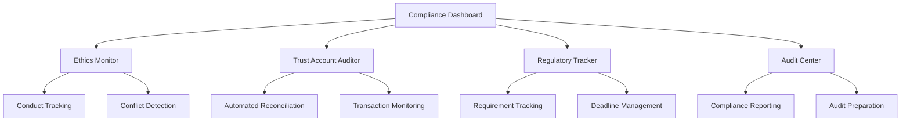

# Advanced Compliance Engine - Product Requirements Document

## 1. Product Overview
Comprehensive compliance monitoring and ethics management system specifically designed for South African legal practices, ensuring adherence to Law Society regulations, trust account requirements, and professional conduct rules.

The system provides real-time monitoring, automated alerts, and intelligent compliance recommendations to prevent ethics violations and maintain professional standards while streamlining administrative compliance tasks.

## 2. Core Features

### 2.1 User Roles
| Role | Registration Method | Core Permissions |
|------|---------------------|------------------|
| Compliance Officer | Practice designation | Full access to all compliance tools, audit trails, and reporting |
| Practice Principal | Admin rights | View compliance status, approve remediation actions, access audit reports |
| Senior Advocate | Automatic enrollment | Monitor personal compliance, receive ethics alerts, access training |
| Trust Account Administrator | Principal appointment | Manage trust accounts, reconciliation, transaction monitoring |

### 2.2 Feature Module
Our Advanced Compliance Engine requirements consist of the following main pages:
1. **Compliance Dashboard**: Real-time compliance status, alert summary, regulatory updates
2. **Ethics Monitor**: Professional conduct tracking, conflict of interest detection, ethics alerts
3. **Trust Account Auditor**: Automated trust account reconciliation, transaction monitoring, audit trails
4. **Regulatory Tracker**: Law Society requirement tracking, deadline management, compliance calendar
5. **Audit Center**: Compliance reporting, audit preparation, documentation management

### 2.3 Page Details

| Page Name | Module Name | Feature description |
|-----------|-------------|---------------------|
| Compliance Dashboard | Real-time Status | Display overall compliance score, active alerts, recent violations with color-coded indicators |
| Compliance Dashboard | Alert Summary | Prioritized list of compliance issues requiring attention with severity levels and deadlines |
| Compliance Dashboard | Regulatory Updates | Latest Law Society updates, regulation changes, and compliance news feed |
| Ethics Monitor | Conduct Tracking | Monitor professional conduct requirements, CPD compliance, and ethics training status |
| Ethics Monitor | Conflict Detection | AI-powered conflict of interest detection across matters, clients, and relationships |
| Ethics Monitor | Ethics Alerts | Automated alerts for potential ethics violations, deadline reminders, and corrective actions |
| Trust Account Auditor | Automated Reconciliation | Daily automated reconciliation of trust accounts with bank statements and transaction logs |
| Trust Account Auditor | Transaction Monitoring | Real-time monitoring of trust account transactions with anomaly detection |
| Trust Account Auditor | Audit Trails | Comprehensive audit trails for all trust account activities with immutable logging |
| Regulatory Tracker | Requirement Tracking | Track compliance with specific Law Society requirements and deadlines |
| Regulatory Tracker | Deadline Management | Automated deadline tracking with escalating reminders and task assignments |
| Regulatory Tracker | Compliance Calendar | Visual calendar of compliance deadlines, renewals, and regulatory events |
| Audit Center | Compliance Reporting | Generate comprehensive compliance reports for internal and external audits |
| Audit Center | Audit Preparation | Automated audit preparation with document collection and compliance verification |
| Audit Center | Documentation Management | Centralized storage and management of compliance documentation and certificates |

## 3. Core Process

**Compliance Officer Flow:**
1. Review daily compliance dashboard for overall practice status
2. Investigate and resolve high-priority compliance alerts
3. Perform trust account reconciliation and review anomalies
4. Generate compliance reports for practice management
5. Update compliance procedures and training materials

**Practice Principal Flow:**
1. Monitor overall compliance health and risk indicators
2. Review and approve remediation actions for compliance issues
3. Access audit reports and compliance metrics for business decisions
4. Ensure adequate compliance resources and training

**Trust Account Administrator Flow:**
1. Perform daily trust account reconciliation and transaction review
2. Investigate and resolve trust account discrepancies
3. Generate trust account reports and audit documentation
4. Monitor trust account compliance with regulatory requirements

## 4. User Interface Design

### 4.1 Design Style
- **Primary Colors**: Judicial Blue (#1E3A8A) for professional compliance elements, Mpondo Gold (#D4AF37) for achievements
- **Alert Colors**: Status Success (#10B981) for compliant items, Status Warning (#F59E0B) for attention needed, Status Error (#EF4444) for violations
- **Button Style**: Professional rounded buttons with subtle shadows, clear action hierarchy
- **Font**: Inter for headings (font-semibold), Source Code Pro for audit trails and technical data
- **Layout Style**: Clean dashboard layout with compliance-focused widgets, sidebar navigation for quick access
- **Icons**: Professional compliance and legal icons with consistent styling

### 4.2 Page Design Overview

| Page Name | Module Name | UI Elements |
|-----------|-------------|-------------|
| Compliance Dashboard | Status Overview | Large status cards with compliance scores, traffic light indicators, trend charts |
| Compliance Dashboard | Alert Summary | Priority-sorted alert list with severity badges, action buttons, and progress indicators |
| Ethics Monitor | Conflict Detection | Interactive relationship maps, conflict matrices, alert notifications with resolution workflows |
| Trust Account Auditor | Reconciliation View | Split-screen comparison of bank statements and internal records with difference highlighting |
| Trust Account Auditor | Transaction Monitoring | Real-time transaction feed with anomaly flags, filtering options, and drill-down capabilities |
| Regulatory Tracker | Compliance Calendar | Interactive calendar with color-coded deadlines, hover details, and quick action buttons |
| Audit Center | Report Generator | Form-based report configuration with preview, export options, and scheduling capabilities |

### 4.3 Responsiveness
Desktop-first design optimized for compliance workflows with tablet support for mobile compliance checks. Touch-friendly interfaces for mobile audit reviews and alert management.

## 5. Compliance Requirements

### 5.1 South African Legal Compliance
- **Law Society of South Africa** regulations and professional conduct rules
- **Trust Account Regulations** for client fund management
- **Professional Indemnity Insurance** requirements and tracking
- **Continuing Professional Development (CPD)** compliance monitoring
- **Admission and Enrollment** requirement tracking

### 5.2 Data Protection & Security
- **POPIA Compliance** for personal information protection
- **Client Confidentiality** maintenance and monitoring
- **Audit Trail Integrity** with immutable logging
- **Access Control** for sensitive compliance data
- **Data Retention** policies for compliance documentation

### 5.3 Trust Account Compliance
- **Daily Reconciliation** requirements
- **Client Fund Segregation** monitoring
- **Interest Calculation** and distribution tracking
- **Overdraft Prevention** and alert systems
- **Audit Documentation** for regulatory inspections