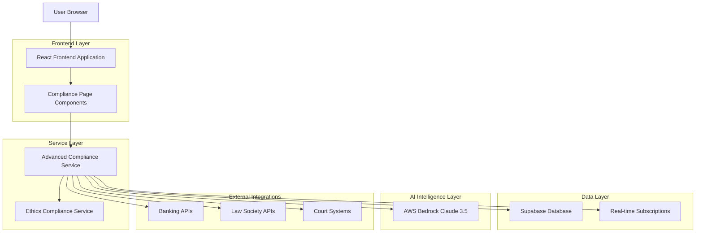
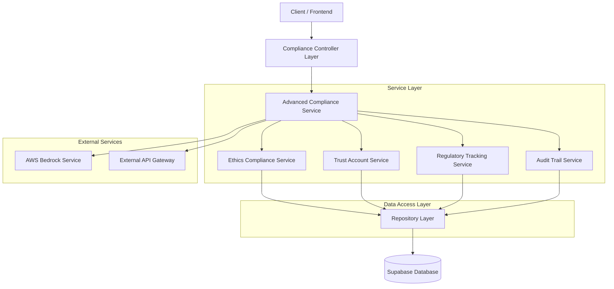
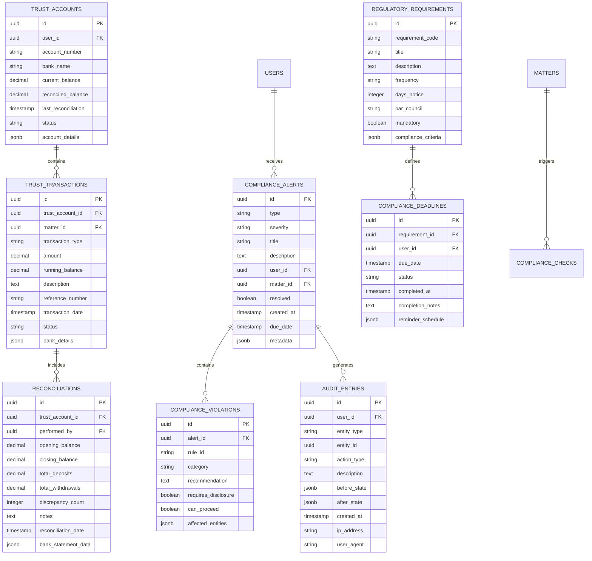

# Advanced Compliance Engine - Technical Architecture Document

## 1. Architecture Design



## 2. Technology Description

- Frontend: React@18 + TypeScript + Tailwind CSS + React Query
- Backend: Supabase (PostgreSQL, Authentication, Real-time subscriptions)
- AI Integration: AWS Bedrock Claude 3.5 Sonnet for intelligent compliance analysis
- Real-time: Supabase real-time subscriptions for live compliance monitoring
- External APIs: Banking integration, Law Society APIs, Court system integration

## 3. Route Definitions

| Route | Purpose |
|-------|---------|
| /compliance | Main compliance dashboard with overview and alerts |
| /compliance/ethics | Ethics monitoring and professional conduct tracking |
| /compliance/trust-account | Trust account management and reconciliation |
| /compliance/regulatory | Regulatory requirement tracking and deadlines |
| /compliance/audit | Audit center with reporting and documentation |
| /compliance/settings | Compliance configuration and rule management |

## 4. API Definitions

### 4.1 Core Compliance API

**Compliance Dashboard Data**
```
GET /api/compliance/dashboard
```

Response:
| Param Name | Param Type | Description |
|------------|------------|-------------|
| overallScore | number | Overall compliance score (0-100) |
| activeAlerts | ComplianceAlert[] | Current active compliance alerts |
| recentViolations | EthicsViolation[] | Recent ethics violations |
| trustAccountStatus | TrustAccountStatus | Current trust account compliance status |
| upcomingDeadlines | RegulatoryDeadline[] | Upcoming regulatory deadlines |

**Ethics Compliance Check**
```
POST /api/compliance/ethics/check
```

Request:
| Param Name | Param Type | isRequired | Description |
|------------|------------|------------|-------------|
| context | EthicsCheckContext | true | Context for ethics rule checking |
| ruleCategories | string[] | false | Specific rule categories to check |

Response:
| Param Name | Param Type | Description |
|------------|------------|-------------|
| violations | EthicsViolation[] | Detected ethics violations |
| recommendations | string[] | Compliance recommendations |
| canProceed | boolean | Whether action can proceed |

**Trust Account Operations**
```
POST /api/compliance/trust-account/reconcile
```

Request:
| Param Name | Param Type | isRequired | Description |
|------------|------------|------------|-------------|
| accountId | string | true | Trust account identifier |
| statementData | BankStatement | true | Bank statement data for reconciliation |
| reconciliationDate | string | true | Date of reconciliation |

Response:
| Param Name | Param Type | Description |
|------------|------------|-------------|
| reconciliationId | string | Unique reconciliation identifier |
| discrepancies | Discrepancy[] | Found discrepancies |
| status | string | Reconciliation status |
| auditTrail | AuditEntry[] | Audit trail entries |

**Compliance Reporting**
```
POST /api/compliance/reports/generate
```

Request:
| Param Name | Param Type | isRequired | Description |
|------------|------------|------------|-------------|
| reportType | string | true | Type of compliance report |
| dateRange | DateRange | true | Report date range |
| includeAuditTrail | boolean | false | Include detailed audit trail |

Response:
| Param Name | Param Type | Description |
|------------|------------|-------------|
| reportId | string | Generated report identifier |
| downloadUrl | string | URL to download report |
| generatedAt | string | Report generation timestamp |

### 4.2 Real-time Compliance Monitoring

**Compliance Alert Subscription**
```
SUBSCRIBE compliance_alerts
```

Real-time events:
- New compliance alerts
- Alert resolution updates
- Trust account transaction notifications
- Regulatory deadline reminders

## 5. Server Architecture Diagram



## 6. Data Model

### 6.1 Data Model Definition



### 6.2 Data Definition Language

**Compliance Alerts Table**
```sql
-- Create compliance alerts table
CREATE TABLE compliance_alerts (
    id UUID PRIMARY KEY DEFAULT gen_random_uuid(),
    type VARCHAR(50) NOT NULL CHECK (type IN ('trust_account', 'billing', 'regulatory', 'ethics', 'audit')),
    severity VARCHAR(20) NOT NULL CHECK (severity IN ('low', 'medium', 'high', 'critical')),
    title VARCHAR(255) NOT NULL,
    description TEXT NOT NULL,
    user_id UUID NOT NULL REFERENCES auth.users(id) ON DELETE CASCADE,
    matter_id UUID REFERENCES matters(id) ON DELETE SET NULL,
    resolved BOOLEAN DEFAULT FALSE,
    created_at TIMESTAMP WITH TIME ZONE DEFAULT NOW(),
    due_date TIMESTAMP WITH TIME ZONE,
    metadata JSONB DEFAULT '{}',
    updated_at TIMESTAMP WITH TIME ZONE DEFAULT NOW()
);

-- Create indexes
CREATE INDEX idx_compliance_alerts_user_id ON compliance_alerts(user_id);
CREATE INDEX idx_compliance_alerts_severity ON compliance_alerts(severity);
CREATE INDEX idx_compliance_alerts_resolved ON compliance_alerts(resolved);
CREATE INDEX idx_compliance_alerts_due_date ON compliance_alerts(due_date);

-- Enable RLS
ALTER TABLE compliance_alerts ENABLE ROW LEVEL SECURITY;

-- Create RLS policies
CREATE POLICY "Users can view their own compliance alerts" ON compliance_alerts
    FOR SELECT USING (auth.uid() = user_id);

CREATE POLICY "Users can insert their own compliance alerts" ON compliance_alerts
    FOR INSERT WITH CHECK (auth.uid() = user_id);

CREATE POLICY "Users can update their own compliance alerts" ON compliance_alerts
    FOR UPDATE USING (auth.uid() = user_id);
```

**Trust Accounts Table**
```sql
-- Create trust accounts table
CREATE TABLE trust_accounts (
    id UUID PRIMARY KEY DEFAULT gen_random_uuid(),
    user_id UUID NOT NULL REFERENCES auth.users(id) ON DELETE CASCADE,
    account_number VARCHAR(50) NOT NULL,
    bank_name VARCHAR(100) NOT NULL,
    current_balance DECIMAL(15,2) DEFAULT 0.00,
    reconciled_balance DECIMAL(15,2) DEFAULT 0.00,
    last_reconciliation TIMESTAMP WITH TIME ZONE,
    status VARCHAR(20) DEFAULT 'active' CHECK (status IN ('active', 'inactive', 'suspended')),
    account_details JSONB DEFAULT '{}',
    created_at TIMESTAMP WITH TIME ZONE DEFAULT NOW(),
    updated_at TIMESTAMP WITH TIME ZONE DEFAULT NOW()
);

-- Create indexes
CREATE INDEX idx_trust_accounts_user_id ON trust_accounts(user_id);
CREATE INDEX idx_trust_accounts_status ON trust_accounts(status);

-- Enable RLS
ALTER TABLE trust_accounts ENABLE ROW LEVEL SECURITY;

-- Create RLS policies
CREATE POLICY "Users can manage their own trust accounts" ON trust_accounts
    FOR ALL USING (auth.uid() = user_id);
```

**Trust Transactions Table**
```sql
-- Create trust transactions table
CREATE TABLE trust_transactions (
    id UUID PRIMARY KEY DEFAULT gen_random_uuid(),
    trust_account_id UUID NOT NULL REFERENCES trust_accounts(id) ON DELETE CASCADE,
    matter_id UUID REFERENCES matters(id) ON DELETE SET NULL,
    transaction_type VARCHAR(20) NOT NULL CHECK (transaction_type IN ('deposit', 'withdrawal', 'transfer', 'interest')),
    amount DECIMAL(15,2) NOT NULL,
    running_balance DECIMAL(15,2) NOT NULL,
    description TEXT NOT NULL,
    reference_number VARCHAR(100),
    transaction_date TIMESTAMP WITH TIME ZONE DEFAULT NOW(),
    status VARCHAR(20) DEFAULT 'completed' CHECK (status IN ('pending', 'completed', 'failed', 'reversed')),
    bank_details JSONB DEFAULT '{}',
    created_at TIMESTAMP WITH TIME ZONE DEFAULT NOW()
);

-- Create indexes
CREATE INDEX idx_trust_transactions_account_id ON trust_transactions(trust_account_id);
CREATE INDEX idx_trust_transactions_matter_id ON trust_transactions(matter_id);
CREATE INDEX idx_trust_transactions_date ON trust_transactions(transaction_date DESC);
CREATE INDEX idx_trust_transactions_type ON trust_transactions(transaction_type);

-- Enable RLS
ALTER TABLE trust_transactions ENABLE ROW LEVEL SECURITY;

-- Create RLS policies
CREATE POLICY "Users can view trust transactions for their accounts" ON trust_transactions
    FOR SELECT USING (
        trust_account_id IN (
            SELECT id FROM trust_accounts WHERE user_id = auth.uid()
        )
    );

CREATE POLICY "Users can insert trust transactions for their accounts" ON trust_transactions
    FOR INSERT WITH CHECK (
        trust_account_id IN (
            SELECT id FROM trust_accounts WHERE user_id = auth.uid()
        )
    );
```

**Regulatory Requirements Table**
```sql
-- Create regulatory requirements table
CREATE TABLE regulatory_requirements (
    id UUID PRIMARY KEY DEFAULT gen_random_uuid(),
    requirement_code VARCHAR(50) UNIQUE NOT NULL,
    title VARCHAR(255) NOT NULL,
    description TEXT NOT NULL,
    frequency VARCHAR(20) NOT NULL CHECK (frequency IN ('annual', 'quarterly', 'monthly', 'weekly', 'daily', 'once_off')),
    days_notice INTEGER DEFAULT 30,
    bar_council VARCHAR(50) NOT NULL CHECK (bar_council IN ('national', 'johannesburg', 'cape_town', 'durban', 'pretoria')),
    mandatory BOOLEAN DEFAULT TRUE,
    compliance_criteria JSONB DEFAULT '{}',
    created_at TIMESTAMP WITH TIME ZONE DEFAULT NOW(),
    updated_at TIMESTAMP WITH TIME ZONE DEFAULT NOW()
);

-- Create indexes
CREATE INDEX idx_regulatory_requirements_code ON regulatory_requirements(requirement_code);
CREATE INDEX idx_regulatory_requirements_bar_council ON regulatory_requirements(bar_council);
CREATE INDEX idx_regulatory_requirements_frequency ON regulatory_requirements(frequency);

-- Insert initial regulatory requirements
INSERT INTO regulatory_requirements (requirement_code, title, description, frequency, days_notice, bar_council, mandatory) VALUES
('CPD_ANNUAL', 'Continuing Professional Development', 'Annual CPD requirement of 15 hours', 'annual', 60, 'national', true),
('TRUST_RECONCILIATION', 'Trust Account Reconciliation', 'Monthly trust account reconciliation', 'monthly', 5, 'national', true),
('PROFESSIONAL_INDEMNITY', 'Professional Indemnity Insurance', 'Annual professional indemnity insurance renewal', 'annual', 30, 'national', true),
('PRACTICE_CERTIFICATE', 'Practice Certificate Renewal', 'Annual practice certificate renewal', 'annual', 45, 'national', true),
('TRUST_AUDIT', 'Trust Account Audit', 'Annual trust account audit', 'annual', 90, 'national', true);
```

**Audit Entries Table**
```sql
-- Create audit entries table
CREATE TABLE audit_entries (
    id UUID PRIMARY KEY DEFAULT gen_random_uuid(),
    user_id UUID NOT NULL REFERENCES auth.users(id) ON DELETE CASCADE,
    entity_type VARCHAR(50) NOT NULL,
    entity_id UUID NOT NULL,
    action_type VARCHAR(50) NOT NULL,
    description TEXT NOT NULL,
    before_state JSONB,
    after_state JSONB,
    created_at TIMESTAMP WITH TIME ZONE DEFAULT NOW(),
    ip_address INET,
    user_agent TEXT
);

-- Create indexes
CREATE INDEX idx_audit_entries_user_id ON audit_entries(user_id);
CREATE INDEX idx_audit_entries_entity ON audit_entries(entity_type, entity_id);
CREATE INDEX idx_audit_entries_created_at ON audit_entries(created_at DESC);
CREATE INDEX idx_audit_entries_action_type ON audit_entries(action_type);

-- Enable RLS
ALTER TABLE audit_entries ENABLE ROW LEVEL SECURITY;

-- Create RLS policies
CREATE POLICY "Users can view their own audit entries" ON audit_entries
    FOR SELECT USING (auth.uid() = user_id);

CREATE POLICY "System can insert audit entries" ON audit_entries
    FOR INSERT WITH CHECK (true);
```

**Database Functions for Compliance**
```sql
-- Function to calculate compliance score
CREATE OR REPLACE FUNCTION calculate_compliance_score(user_uuid UUID)
RETURNS INTEGER AS $$
DECLARE
    total_requirements INTEGER;
    met_requirements INTEGER;
    active_violations INTEGER;
    score INTEGER;
BEGIN
    -- Count total applicable requirements
    SELECT COUNT(*) INTO total_requirements
    FROM regulatory_requirements
    WHERE mandatory = true;
    
    -- Count met requirements (no active deadlines)
    SELECT COUNT(*) INTO met_requirements
    FROM compliance_deadlines cd
    JOIN regulatory_requirements rr ON cd.requirement_id = rr.id
    WHERE cd.user_id = user_uuid
    AND cd.status = 'completed'
    AND rr.mandatory = true;
    
    -- Count active violations
    SELECT COUNT(*) INTO active_violations
    FROM compliance_alerts
    WHERE user_id = user_uuid
    AND resolved = false
    AND severity IN ('high', 'critical');
    
    -- Calculate score
    IF total_requirements = 0 THEN
        score := 100;
    ELSE
        score := GREATEST(0, 
            (met_requirements * 100 / total_requirements) - (active_violations * 10)
        );
    END IF;
    
    RETURN LEAST(100, score);
END;
$$ LANGUAGE plpgsql SECURITY DEFINER;

-- Function to auto-generate compliance deadlines
CREATE OR REPLACE FUNCTION generate_compliance_deadlines()
RETURNS VOID AS $$
DECLARE
    req RECORD;
    user_rec RECORD;
    next_due_date TIMESTAMP WITH TIME ZONE;
BEGIN
    FOR req IN SELECT * FROM regulatory_requirements WHERE mandatory = true LOOP
        FOR user_rec IN SELECT id FROM auth.users LOOP
            -- Calculate next due date based on frequency
            CASE req.frequency
                WHEN 'annual' THEN
                    next_due_date := DATE_TRUNC('year', NOW()) + INTERVAL '1 year';
                WHEN 'quarterly' THEN
                    next_due_date := DATE_TRUNC('quarter', NOW()) + INTERVAL '3 months';
                WHEN 'monthly' THEN
                    next_due_date := DATE_TRUNC('month', NOW()) + INTERVAL '1 month';
                ELSE
                    next_due_date := NOW() + INTERVAL '1 year';
            END CASE;
            
            -- Insert deadline if not exists
            INSERT INTO compliance_deadlines (requirement_id, user_id, due_date, status)
            SELECT req.id, user_rec.id, next_due_date, 'pending'
            WHERE NOT EXISTS (
                SELECT 1 FROM compliance_deadlines
                WHERE requirement_id = req.id
                AND user_id = user_rec.id
                AND status = 'pending'
            );
        END LOOP;
    END LOOP;
END;
$$ LANGUAGE plpgsql SECURITY DEFINER;
```

## 7. Component Architecture

### 7.1 Page Component Structure
```
src/pages/CompliancePage.tsx (Main compliance dashboard)
├── ComplianceOverview (Dashboard summary)
├── ComplianceAlerts (Alert management)
├── EthicsMonitor (Ethics compliance tracking)
├── TrustAccountManager (Trust account operations)
├── RegulatoryTracker (Regulatory deadlines)
└── AuditCenter (Audit trails and reporting)
```

### 7.2 Shared Components
```
src/components/compliance/
├── ComplianceScoreCard.tsx
├── AlertsList.tsx
├── TrustAccountReconciliation.tsx
├── RegulatoryCalendar.tsx
├── ComplianceReportGenerator.tsx
├── EthicsViolationModal.tsx
└── AuditTrailViewer.tsx
```

### 7.3 Service Integration
```
src/services/api/advanced-compliance.service.ts
├── Extends existing ethics-compliance.service.ts
├── Trust account management
├── Regulatory tracking
├── Audit trail management
├── Real-time compliance monitoring
└── AWS Bedrock integration for intelligent insights
```

## 8. Security and Compliance Requirements

### 8.1 Data Security
- **Encryption**: All sensitive compliance data encrypted at rest and in transit
- **Access Control**: Role-based access with audit trails
- **Data Retention**: Configurable retention policies for compliance records
- **Backup**: Automated backup with point-in-time recovery

### 8.2 Audit Requirements
- **Immutable Logs**: All compliance actions logged immutably
- **User Attribution**: All actions attributed to specific users
- **Timestamp Integrity**: Cryptographic timestamps for audit entries
- **Export Capability**: Audit logs exportable for external review

### 8.3 Compliance Standards
- **POPIA Compliance**: Personal information protection
- **Law Society Requirements**: South African legal practice standards
- **Trust Account Regulations**: Client fund management compliance
- **Professional Conduct**: Ethics and professional standards

## 9. Performance Considerations

### 9.1 Real-time Performance
- **WebSocket Connections**: Efficient real-time compliance monitoring
- **Event Debouncing**: Prevent excessive alert generation
- **Caching Strategy**: Redis caching for frequently accessed compliance data
- **Database Optimization**: Indexed queries for compliance lookups

### 9.2 Scalability
- **Horizontal Scaling**: Microservice architecture for compliance modules
- **Load Balancing**: Distribute compliance checking across instances
- **Queue Management**: Background processing for compliance calculations
- **Resource Monitoring**: Proactive monitoring of compliance system health

## 10. Integration Points

### 10.1 Internal System Integration
- **Matter Management**: Automatic compliance checks on matter creation
- **Invoice System**: Billing compliance validation
- **Time Tracking**: Professional conduct monitoring
- **User Management**: Role-based compliance requirements

### 10.2 External API Integration
- **Banking APIs**: Automated trust account reconciliation
- **Law Society APIs**: Real-time regulatory updates
- **Court Systems**: Automated deadline tracking
- **Document Management**: Compliance document storage

## 11. Monitoring and Alerting

### 11.1 System Monitoring
- **Compliance Score Tracking**: Real-time compliance score monitoring
- **Alert Response Times**: Track alert resolution performance
- **System Health**: Monitor compliance service availability
- **User Engagement**: Track compliance feature usage

### 11.2 Business Intelligence
- **Compliance Trends**: Historical compliance performance analysis
- **Risk Assessment**: Predictive compliance risk modeling
- **Benchmark Reporting**: Practice compliance benchmarking
- **Regulatory Impact**: Track impact of regulatory changes