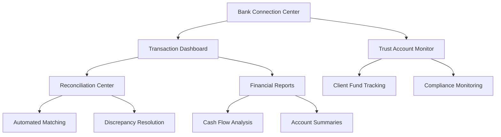

# Direct Bank Feed Integration - Product Requirements Document

## 1. Product Overview
Automated bank account integration system that provides real-time synchronization with South African banking institutions, enabling automatic reconciliation, transaction categorization, and financial reporting for legal practices.

The system connects directly with major South African banks (Standard Bank, FNB, ABSA, Nedbank, Capitec) to eliminate manual data entry and ensure accurate, up-to-date financial information for practice management and compliance.

## 2. Core Features

### 2.1 User Roles
| Role | Registration Method | Core Permissions |
|------|---------------------|------------------|
| Financial Administrator | Practice designation | Full access to bank connections, reconciliation, and financial data |
| Practice Principal | Admin rights | View all financial data, approve bank connections, access reports |
| Bookkeeper | Administrator invitation | Manage transactions, perform reconciliation, generate financial reports |
| Trust Account Manager | Principal appointment | Manage trust account connections, monitor client funds, ensure compliance |

### 2.2 Feature Module
Our Direct Bank Feed Integration requirements consist of the following main pages:
1. **Bank Connection Center**: Bank account setup, connection management, authentication status
2. **Transaction Dashboard**: Real-time transaction feeds, categorization, reconciliation status
3. **Reconciliation Center**: Automated matching, discrepancy resolution, manual adjustments
4. **Financial Reports**: Automated financial reporting, cash flow analysis, account summaries
5. **Trust Account Monitor**: Dedicated trust account management, client fund tracking, compliance monitoring

### 2.3 Page Details

| Page Name | Module Name | Feature description |
|-----------|-------------|---------------------|
| Bank Connection Center | Account Setup | Connect multiple bank accounts with secure OAuth authentication and permission management |
| Bank Connection Center | Connection Management | Monitor connection status, refresh tokens, troubleshoot connection issues |
| Bank Connection Center | Security Settings | Manage API permissions, encryption settings, and access controls for bank data |
| Transaction Dashboard | Real-time Feed | Display live transaction feeds from connected banks with automatic categorization |
| Transaction Dashboard | Smart Categorization | AI-powered transaction categorization using Claude 3.5 Sonnet for legal practice contexts |
| Transaction Dashboard | Duplicate Detection | Identify and merge duplicate transactions across multiple accounts and systems |
| Reconciliation Center | Automated Matching | Match bank transactions with invoices, payments, and internal financial records |
| Reconciliation Center | Discrepancy Resolution | Identify and resolve reconciliation discrepancies with guided workflows |
| Reconciliation Center | Manual Adjustments | Handle manual adjustments, corrections, and special transaction processing |
| Financial Reports | Automated Reporting | Generate real-time financial reports with bank data integration |
| Financial Reports | Cash Flow Analysis | Analyze cash flow patterns with predictive insights and trend analysis |
| Financial Reports | Account Summaries | Comprehensive account summaries with balance tracking and transaction history |
| Trust Account Monitor | Client Fund Tracking | Monitor individual client trust account balances and transactions |
| Trust Account Monitor | Compliance Monitoring | Ensure trust account compliance with Law Society regulations and audit requirements |
| Trust Account Monitor | Interest Calculation | Automated interest calculation and distribution for client trust funds |

## 3. Core Process

**Financial Administrator Flow:**
1. Set up and manage bank account connections with secure authentication
2. Monitor daily transaction feeds and resolve any connection issues
3. Review automated transaction categorization and make corrections
4. Perform reconciliation and resolve discrepancies
5. Generate financial reports and ensure data accuracy

**Practice Principal Flow:**
1. Review overall financial position with real-time bank data
2. Monitor cash flow and account balances across all connected accounts
3. Access comprehensive financial reports for business decision-making
4. Ensure compliance with trust account regulations

**Trust Account Manager Flow:**
1. Monitor trust account transactions and client fund movements
2. Ensure proper segregation of client funds and compliance
3. Generate trust account reports and audit documentation
4. Manage interest calculations and distributions

## 4. User Interface Design

### 4.1 Design Style
- **Primary Colors**: Banking Blue (#0066CC) for financial elements, Mpondo Gold (#D4AF37) for success indicators
- **Status Colors**: Status Success (#10B981) for connected accounts, Status Warning (#F59E0B) for attention needed, Status Error (#EF4444) for connection issues
- **Button Style**: Professional rounded buttons with banking-grade security indicators
- **Font**: Inter for headings (font-semibold), JetBrains Mono for financial figures and account numbers
- **Layout Style**: Clean financial dashboard with account-focused widgets, secure connection indicators
- **Icons**: Banking and financial icons with security badges and connection status indicators

### 4.2 Page Design Overview

| Page Name | Module Name | UI Elements |
|-----------|-------------|-------------|
| Bank Connection Center | Account Setup | Bank logo cards with connection status, secure authentication flows, permission toggles |
| Bank Connection Center | Connection Management | Status dashboard with connection health, last sync times, error notifications |
| Transaction Dashboard | Real-time Feed | Live transaction stream with categorization tags, amount highlighting, search filters |
| Transaction Dashboard | Smart Categorization | Drag-and-drop categorization interface, confidence scores, bulk editing tools |
| Reconciliation Center | Automated Matching | Side-by-side comparison views, match confidence indicators, approval workflows |
| Reconciliation Center | Discrepancy Resolution | Highlighted differences, resolution suggestions, manual override options |
| Trust Account Monitor | Client Fund Tracking | Client-specific balance cards, transaction timelines, compliance status indicators |
| Financial Reports | Report Generator | Interactive report builder with real-time data, export options, scheduling capabilities |

### 4.3 Responsiveness
Desktop-first design optimized for financial workflows with mobile support for transaction monitoring and approval workflows. Touch-friendly interfaces for mobile reconciliation and report access.

## 5. Banking Integration Requirements

### 5.1 South African Bank Support
- **Standard Bank** - API integration with business banking services
- **First National Bank (FNB)** - Connect API for business accounts
- **ABSA Bank** - Business banking API integration
- **Nedbank** - Business API connectivity
- **Capitec Bank** - Business account integration
- **Other Banks** - Generic banking API support for smaller institutions

### 5.2 Security & Compliance
- **Open Banking Standards** - Compliance with South African open banking regulations
- **PCI DSS Compliance** - Payment card industry security standards
- **OAuth 2.0 Authentication** - Secure bank authentication and authorization
- **Data Encryption** - End-to-end encryption for all banking data
- **Audit Logging** - Comprehensive audit trails for all banking transactions

### 5.3 Transaction Processing
- **Real-time Synchronization** - Live transaction feeds with minimal delay
- **Automatic Categorization** - AI-powered transaction categorization for legal practices
- **Duplicate Detection** - Intelligent duplicate transaction identification and merging
- **Reconciliation Automation** - Automated matching with internal financial records
- **Error Handling** - Robust error handling and retry mechanisms for banking APIs

### 5.4 Trust Account Compliance
- **Client Fund Segregation** - Proper separation of client and practice funds
- **Interest Calculation** - Automated interest calculation for client trust accounts
- **Compliance Reporting** - Automated compliance reports for Law Society requirements
- **Audit Trail Maintenance** - Immutable audit trails for all trust account transactions