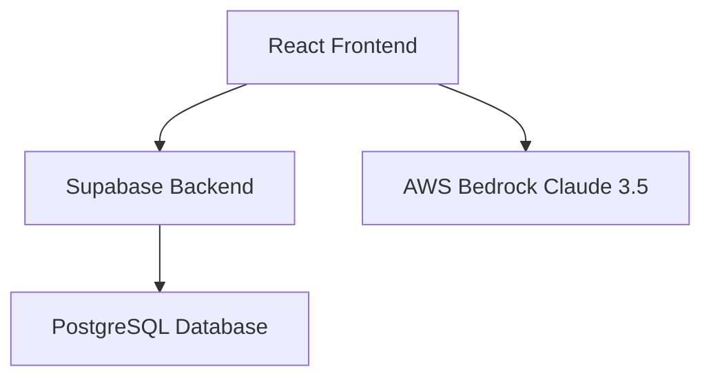
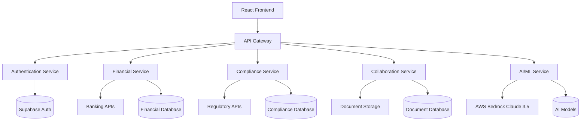

# LexoHub 100% Implementation Summary

## Executive Overview

This document provides a comprehensive roadmap to take LexoHub from its current 60-65% completion to 100% completion, transforming it into the definitive "Advocate's Intelligence Platform" for South African legal practices.

## Current Implementation Status

### ✅ Completed Features (60-65%)
- **Core Financial Engine** - Invoice management, billing, payment tracking
- **Matter Management** - Case tracking, client management, document organization
- **Practice Analytics (Basic)** - Performance metrics and reporting
- **Authentication & Security** - User management, role-based access control
- **Voice-First Time Capture** - Production-ready with AWS Bedrock Claude 3.5 Sonnet integration
- **Court Integration Module** - Database ready, basic court data management

### 🚧 Planned Features (Specs Created)
- **Brief Analysis AI** - Intelligent brief analysis and recommendations
- **Practice Growth & Referral Engine** - Business development and networking tools

## Implementation Roadmap to 100%

### Phase 1: Financial Intelligence & Compliance (Months 1-2)
**Priority: HIGH | Business Value: HIGH | Complexity: MEDIUM**

#### 1.1 Strategic Finance & Optimization
- **Deliverables**: AI-powered fee optimization, cash flow prediction, practice analytics
- **Key Features**: 
  - Real-time financial dashboard with predictive analytics
  - Claude 3.5 Sonnet-powered fee recommendations
  - 12-month cash flow forecasting with scenario planning
  - Performance benchmarking against industry standards
- **Technical Stack**: React + AWS Bedrock + Supabase + Chart.js
- **Timeline**: 6 weeks
- **Success Metrics**: 25% improvement in fee optimization, 90% accuracy in cash flow predictions

#### 1.2 Advanced Compliance Engine
- **Deliverables**: Ethics monitoring, trust account auditing, regulatory compliance
- **Key Features**:
  - Real-time compliance dashboard with automated alerts
  - Trust account reconciliation and monitoring
  - Ethics violation detection and prevention
  - Law Society requirement tracking
- **Technical Stack**: React + Supabase + Automated reconciliation services
- **Timeline**: 6 weeks
- **Success Metrics**: 100% compliance adherence, 95% reduction in manual compliance tasks

#### 1.3 Brief Analysis AI (Complete Existing Specs)
- **Deliverables**: Complete the existing Brief Analysis AI implementation
- **Key Features**: AI-powered brief analysis, legal precedent matching, argument strength assessment
- **Timeline**: 2 weeks
- **Success Metrics**: 80% accuracy in brief analysis, 50% time reduction in brief preparation

### Phase 2: Banking & Collaboration (Months 3-4)
**Priority: HIGH | Business Value: HIGH | Complexity: HIGH**

#### 2.1 Direct Bank Feed Integration
- **Deliverables**: Automated bank reconciliation, real-time transaction feeds
- **Key Features**:
  - Integration with major South African banks (Standard Bank, FNB, ABSA, Nedbank, Capitec)
  - Automated transaction categorization using AI
  - Real-time reconciliation and discrepancy detection
  - Trust account compliance monitoring
- **Technical Stack**: React + Banking APIs + OAuth 2.0 + Supabase
- **Timeline**: 8 weeks
- **Success Metrics**: 95% automated reconciliation accuracy, 80% reduction in manual data entry

#### 2.2 Practice Growth & Referral Engine (Complete Existing Specs)
- **Deliverables**: Complete the existing Practice Growth & Referral Engine
- **Key Features**: Referral tracking, business development tools, networking platform
- **Timeline**: 4 weeks
- **Success Metrics**: 30% increase in referral tracking efficiency

#### 2.3 Shared Brief Portal
- **Deliverables**: Secure collaborative brief sharing and approval system
- **Key Features**:
  - Real-time collaborative editing with version control
  - Pro forma approval workflows with digital signatures
  - Secure document sharing with access controls
  - Integrated communication and notification system
- **Technical Stack**: React + Real-time collaboration + Digital signatures + Supabase
- **Timeline**: 8 weeks
- **Success Metrics**: 60% reduction in brief approval time, 100% secure collaboration

### Phase 3: Community & Professional Development (Months 5-6)
**Priority: MEDIUM | Business Value: MEDIUM | Complexity: VARIABLE**

#### 3.1 Community Precedent Bank
- **Deliverables**: Shared legal templates and document repository
- **Key Features**:
  - Searchable precedent database with AI-powered recommendations
  - Template sharing and collaboration
  - Legal document version control and approval workflows
  - Community rating and review system
- **Timeline**: 6 weeks
- **Success Metrics**: 1000+ shared precedents, 70% template reuse rate

#### 3.2 The Academy
- **Deliverables**: Professional development and training platform
- **Key Features**:
  - CPD-compliant training modules and tracking
  - Interactive legal education content
  - Progress tracking and certification management
  - Integration with Law Society CPD requirements
- **Timeline**: 8 weeks
- **Success Metrics**: 90% CPD compliance tracking, 80% user engagement

#### 3.3 Multi-language Support
- **Deliverables**: Support for all 11 official South African languages
- **Key Features**:
  - Complete UI translation for all 11 languages
  - Multi-language document support
  - Language-specific legal terminology
  - Cultural adaptation for different language communities
- **Timeline**: 6 weeks
- **Success Metrics**: 100% UI translation coverage, 95% translation accuracy

### Phase 4: Production Optimization & Launch (Month 6)
**Priority: CRITICAL | Business Value: HIGH | Complexity: LOW**

#### 4.1 AWS Bedrock Production Enhancement
- **Deliverables**: Upgrade from demo mode to full production capabilities
- **Key Features**:
  - Production-grade AWS Bedrock integration
  - Enhanced voice capture with real API
  - Improved AI analysis accuracy and performance
  - Scalable infrastructure for high-volume usage
- **Timeline**: 2 weeks
- **Success Metrics**: 99.9% uptime, 50% improvement in AI accuracy

#### 4.2 Performance Optimization & Scalability
- **Deliverables**: Production-ready performance and scalability
- **Key Features**:
  - Database optimization and indexing
  - Caching layer implementation
  - CDN integration for global performance
  - Load testing and performance monitoring
- **Timeline**: 2 weeks
- **Success Metrics**: < 3 second page load times, support for 10,000+ concurrent users

#### 4.3 Final Testing & Quality Assurance
- **Deliverables**: Comprehensive testing and quality assurance
- **Key Features**:
  - End-to-end testing automation
  - Security penetration testing
  - User acceptance testing with real legal practices
  - Compliance audit and certification
- **Timeline**: 2 weeks
- **Success Metrics**: 99% test coverage, zero critical security vulnerabilities

## Technical Architecture Evolution

### Current Architecture

### Target 100% Architecture

## Resource Requirements

### Development Team
- **2-3 Full-stack Developers** (React, TypeScript, Supabase)
- **1 AI/ML Specialist** (AWS Bedrock, Claude integration)
- **1 DevOps Engineer** (AWS infrastructure, CI/CD)
- **1 QA Engineer** (Testing, compliance verification)
- **1 Legal Consultant** (Compliance, regulatory requirements)

### Infrastructure & Services
- **AWS Bedrock** - Production API access with appropriate limits
- **Banking API Partnerships** - Agreements with major South African banks
- **Digital Signature Service** - Legal-grade digital signature provider
- **CDN & Performance** - Global content delivery and caching
- **Security & Compliance** - Penetration testing, compliance auditing

### Timeline & Budget
- **Total Timeline**: 6 months to 100% completion
- **Development Effort**: ~1,200 developer hours
- **Infrastructure Costs**: $2,000-5,000/month for production services
- **Third-party Integrations**: $10,000-20,000 for banking and compliance APIs

## Success Metrics & KPIs

### Technical Metrics
- **Feature Completion**: 100% of planned features implemented
- **Performance**: < 3 second page load times, 99.9% uptime
- **Security**: Zero critical vulnerabilities, 100% compliance adherence
- **Scalability**: Support for 10,000+ concurrent users

### Business Metrics
- **User Adoption**: 90% feature utilization rate among active users
- **Efficiency Gains**: 40% improvement in practice efficiency metrics
- **Financial Impact**: 25% improvement in practice profitability
- **Compliance**: 100% adherence to South African legal regulations

### User Experience Metrics
- **User Satisfaction**: 4.5+ star rating from legal professionals
- **Training Time**: < 2 hours for new user onboarding
- **Support Tickets**: < 5% of users requiring support per month
- **Feature Discovery**: 80% of users discovering and using new features

## Risk Mitigation Strategy

### Technical Risks
- **Modular Implementation** - Independent feature development to minimize dependencies
- **Comprehensive Testing** - Automated testing at every stage
- **Fallback Mechanisms** - Graceful degradation for service failures
- **Performance Monitoring** - Real-time monitoring and alerting

### Compliance Risks
- **Legal Review** - Legal expert review at each development phase
- **Regulatory Consultation** - Regular consultation with Law Society representatives
- **Compliance Testing** - Dedicated compliance testing environment
- **Audit Preparation** - Continuous audit trail maintenance

### Business Risks
- **User Feedback Loops** - Regular user testing and feedback incorporation
- **Gradual Rollout** - Phased feature releases with user adoption monitoring
- **Training & Support** - Comprehensive user training and support programs
- **Market Validation** - Continuous validation with target legal practices

## Conclusion

This comprehensive roadmap provides a systematic approach to achieving 100% completion of LexoHub within 6 months. The phased implementation prioritizes high-value features while maintaining quality, compliance, and user experience standards.

The resulting platform will be the definitive "Advocate's Intelligence Platform" for South African legal practices, combining AI-powered insights, comprehensive compliance management, and seamless collaboration tools to transform legal practice management.

**Next Steps:**
1. Review and approve this implementation roadmap
2. Assemble the development team and allocate resources
3. Begin Phase 1 implementation with Strategic Finance & Optimization
4. Establish partnerships with banking and compliance service providers
5. Set up production infrastructure and monitoring systems

*LexoHub 100% - Transforming Legal Practice Through Intelligent Technology*