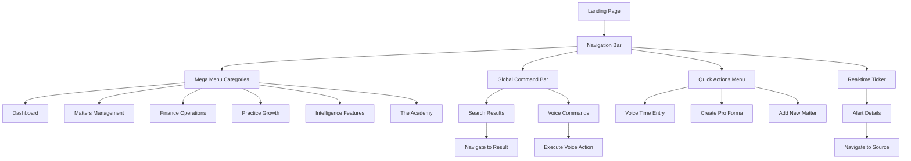

# LexoHub Navigation System - Product Requirements Document

## 1. Product Overview

LexoHub Navigation System is a sophisticated, AI-powered navigation interface designed to transform how South African advocates interact with their practice management platform. This hybrid navigation system combines traditional menu structures with intelligent command interfaces, voice activation, and real-time alerts to create an intuitive, efficient user experience that scales from junior advocates to enterprise chambers.

The system addresses the core challenge of complex legal software navigation by providing multiple interaction paradigms: visual navigation through mega menus, intelligent search through a global command bar, voice-activated commands, and proactive alerts through a real-time ticker system.

Target market value: Enhanced user productivity by 40% through reduced navigation time and intelligent task automation, supporting LexoHub's mission to amplify advocate practices through intelligent technology.

## 2. Core Features

### 2.1 User Roles

| Role | Registration Method | Core Permissions |
|------|---------------------|------------------|
| Junior Start | Email registration + subscription (R599/month) | Basic navigation, limited mega menu access, no voice commands |
| Advocate Pro | Email registration + subscription (R899/month) | Full navigation, basic voice commands, ticker alerts |
| Senior Advocate | Email registration + subscription (R1,299/month) | Advanced AI features, unlimited voice commands, full ticker access |
| Chambers Enterprise | Custom onboarding + enterprise contract | All features + workspace switcher, admin panel, multi-user management |

### 2.2 Feature Module

Our navigation system requirements consist of the following main components:

1. **Hybrid Navigation Bar**: Top-level category navigation with mega menu dropdowns, responsive design, and accessibility compliance
2. **Global Command Bar**: Intelligent search interface with voice activation, keyboard shortcuts, and contextual results
3. **Quick Actions Menu**: High-frequency task shortcuts with customizable actions and usage analytics
4. **Real-time Ticker**: Alert cycling system with WebSocket integration and priority-based messaging
5. **Voice Command Interface**: AWS Claude-powered natural language processing with ElevenLabs voice response
6. **Role-based Access Control**: Subscription tier-based feature filtering with upgrade prompts

### 2.3 Page Details

| Page Name | Module Name | Feature description |
|-----------|-------------|---------------------|
| Navigation Bar | Top-level Categories | Display six main categories (Dashboard, Matters, Finance, Growth, Intelligence, Academy) with hover states and active highlighting |
| Navigation Bar | Mega Menu System | Multi-column dropdown panels with 3-4 columns per category, 300ms hover delay, keyboard navigation support |
| Navigation Bar | Responsive Behavior | Desktop full menus (1024px+), tablet condensed (768px-1023px), mobile hamburger (<768px) with touch gestures |
| Command Bar | Search Interface | Global search with Cmd/Ctrl+K shortcut, fuzzy search implementation, categorized results display |
| Command Bar | Voice Activation | Microphone icon integration, voice capture modal, transcript display with confidence scoring |
| Command Bar | Quick Results | Real-time search results with matter/client/invoice/action categories, keyboard navigation, recent searches |
| Quick Actions | Action Menu | Dropdown with 5 default actions (Voice Time Entry, Create Pro Forma, Add Matter, Analyze Brief, Quick Invoice) |
| Quick Actions | Customization | User-configurable action list, usage analytics tracking, most-used actions prioritization |
| Real-time Ticker | Alert Display | 300px fixed width cycling display with icon-based alert types, severity color coding |
| Real-time Ticker | WebSocket Integration | Real-time updates for overdue invoices, budget alerts, calendar events, conflict checks |
| Voice Commands | Natural Language Processing | AWS Claude Sonnet 3.5 integration for intent recognition, entity extraction, confidence scoring |
| Voice Commands | Response System | ElevenLabs text-to-speech integration, configurable voice settings, streaming audio responses |
| Access Control | Feature Filtering | Subscription tier-based navigation filtering, upgrade prompts, graceful feature degradation |
| Access Control | Permission Management | Role-based menu item visibility, command bar feature restrictions, ticker alert type filtering |

## 3. Core Process

### Regular User Flow
1. User accesses LexoHub dashboard and sees the hybrid navigation bar with six main categories
2. User hovers over a category (e.g., "Matters") to reveal the mega menu with organized sub-sections
3. User can either click directly on a menu item or use the global command bar (Cmd/Ctrl+K) for quick search
4. Voice-enabled users can activate voice commands and speak natural language requests
5. Real-time ticker displays relevant alerts and notifications based on user's current context
6. Quick actions menu provides one-click access to frequently used features

### Voice Command Flow
1. User activates voice input via keyboard shortcut (Ctrl+Shift+V) or microphone icon
2. System captures audio using Web Speech API and displays listening state
3. Transcript is sent to AWS Claude for natural language understanding
4. System processes intent and executes appropriate action or navigation
5. ElevenLabs provides optional voice confirmation of completed actions

### Admin/Enterprise Flow
1. Enterprise users access additional workspace switcher and admin panel options
2. Administrators can configure navigation permissions for team members
3. Custom branding options allow chambers to personalize the navigation experience
4. Multi-user management enables role-based access control across the organization

## 4. User Interface Design

### 4.1 Design Style

**Primary Colors:**
- Mpondo Gold: #D4AF37 (primary brand color)
- Judicial Blue: #1E3A8A (secondary brand color)
- Status Success: #22c55e
- Status Warning: #f59e0b
- Status Error: #ef4444

**Button Style:**
- Design system components with variants (primary, secondary, outline, ghost)
- Rounded corners (border-radius: 0.5rem)
- Hover states with smooth transitions (200ms ease-out)
- Focus rings for accessibility compliance

**Typography:**
- Primary font: Inter (font-sans)
- Monospace font: JetBrains Mono (font-mono)
- Font sizes: 14px (base), 16px (large), 12px (small)
- Line heights: 1.5 (base), 1.25 (headings)

**Layout Style:**
- Card-based design with soft shadows (shadow-soft)
- Top navigation with fixed positioning
- Generous padding (16px-24px) for professional feel
- Grid-based mega menu columns

**Animation & Icons:**
- Lucide React icons throughout
- Smooth transitions: scale-in, slide-up, fade-in animations
- Hover delays (300ms) for mega menu activation
- Pulse animations for onboarding hints

### 4.2 Page Design Overview

| Page Name | Module Name | UI Elements |
|-----------|-------------|-------------|
| Navigation Bar | Top Categories | Horizontal bar with mpondo-gold-600 accent, neutral-900 text, hover states with neutral-100 background |
| Navigation Bar | Mega Menu | White background with shadow-soft, 3-4 column grid layout, judicial-blue-600 section headings |
| Command Bar | Search Input | Prominent position with neutral-200 border, focus ring in mpondo-gold-500, microphone icon on right |
| Command Bar | Results Dropdown | Max height 400px with scroll, categorized sections, hover highlighting in neutral-100 |
| Quick Actions | Action Button | Large + icon in mpondo-gold-600, positioned right side, tooltip with keyboard shortcut |
| Quick Actions | Dropdown Menu | White background, action items with lucide icons, keyboard shortcut hints in neutral-500 |
| Ticker | Alert Display | Fixed 300px width, icon-based alerts, severity color coding (blue/yellow/red), smooth fade transitions |
| Ticker | Alert Content | Truncated text with hover expansion, click-to-navigate functionality, dismiss buttons |
| Voice Interface | Capture Modal | Centered modal with pulsing microphone, transcript display, confidence indicators |
| Voice Interface | Suggested Commands | Grouped by category, microphone icon + text, dismissible with "Got it" button |
| Access Control | Upgrade Prompts | Card-based overlays with mpondo-gold accent, clear tier comparison, call-to-action buttons |

### 4.3 Responsiveness

**Desktop-first Design (1024px+):**
- Full mega menu system with 3-4 columns
- Hover-activated dropdowns with 300ms delay
- Global command bar prominently positioned
- Real-time ticker visible on left side

**Tablet Optimization (768px-1023px):**
- Condensed 2-column mega menus
- Touch-optimized tap targets (minimum 44px)
- Slide-down animations for menu activation
- Maintained command bar functionality

**Mobile Adaptation (<768px):**
- Hamburger menu conversion with full-screen drawer
- Accordion-style category expansion
- Swipe-to-close gesture support
- Floating action button for quick actions
- Voice activation via dedicated button

**Touch Interaction Optimization:**
- Prevents body scroll when mobile menu open
- Touch gesture support for navigation
- Optimized for iOS Safari and Chrome mobile
- Accessible focus management across all breakpoints