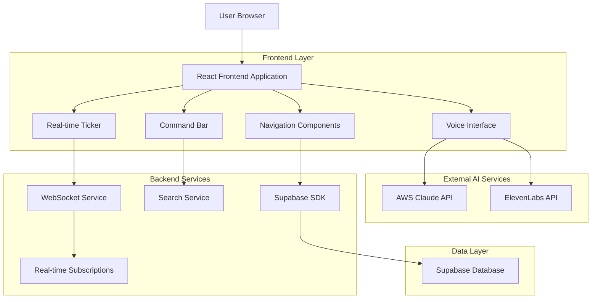
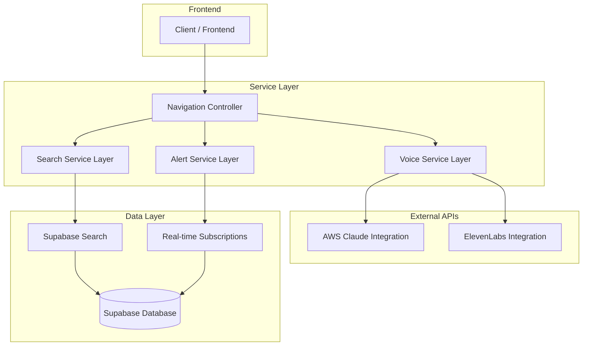
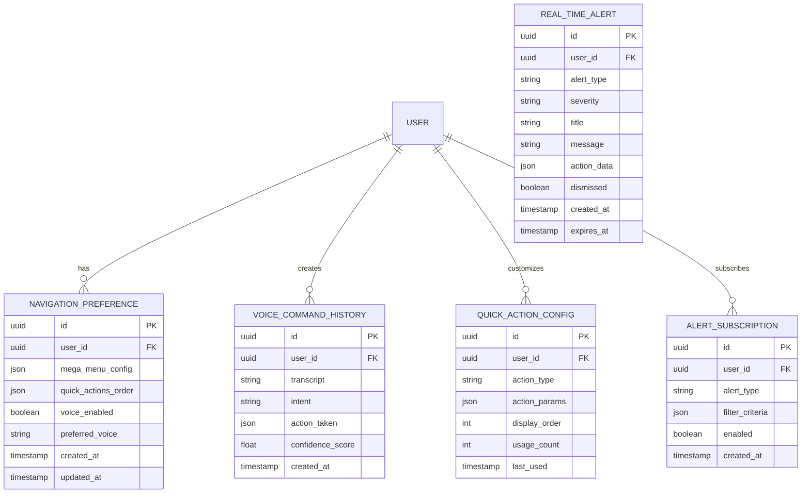

# LexoHub Navigation System - Technical Architecture Document

## 1. Architecture Design



## 2. Technology Description

- **Frontend**: React@18 + TypeScript@5 + Tailwind CSS@3 + Vite
- **Backend**: Supabase (Authentication, Database, Real-time subscriptions)
- **AI Services**: AWS Claude Sonnet 3.5 (NLP), ElevenLabs (Text-to-Speech)
- **State Management**: React Context + Custom Hooks
- **Voice Processing**: Web Speech API + Custom Audio Processing
- **Real-time**: Supabase Real-time subscriptions
- **Icons**: Lucide React
- **Testing**: Vitest + React Testing Library

## 3. Route Definitions

| Route | Purpose |
|-------|---------|
| / | Dashboard with full navigation system |
| /matters | Matters management with contextual navigation |
| /matters/:id | Individual matter view with breadcrumb navigation |
| /finance | Financial operations with specialized quick actions |
| /finance/invoices | Invoice management with finance-specific ticker alerts |
| /growth | Practice growth tools with analytics navigation |
| /intelligence | AI-powered features with voice command prominence |
| /academy | Learning platform with progress-aware navigation |
| /settings | User preferences including navigation customization |
| /admin | Enterprise administration (Chambers tier only) |

## 4. API Definitions

### 4.1 Core Navigation API

**Voice Command Processing**
```
POST /api/voice/process
```

Request:
| Param Name | Param Type | isRequired | Description |
|------------|------------|------------|-------------|
| transcript | string | true | Voice transcript from Web Speech API |
| context | object | true | Current page context and user state |
| confidence | number | true | Speech recognition confidence score |

Response:
| Param Name | Param Type | Description |
|------------|------------|-------------|
| intent | string | Recognized user intent (navigate, create, search, etc.) |
| action | object | Action to execute with parameters |
| response | string | Text response for voice synthesis |
| confidence | number | NLP confidence score |

Example:
```json
{
  "transcript": "Create a new matter for John Smith",
  "context": {
    "currentPage": "/dashboard",
    "userRole": "advocate_pro"
  },
  "confidence": 0.95
}
```

**Search API**
```
GET /api/search
```

Request:
| Param Name | Param Type | isRequired | Description |
|------------|------------|------------|-------------|
| query | string | true | Search query string |
| category | string | false | Filter by category (matters, clients, invoices) |
| limit | number | false | Maximum results (default: 10) |

Response:
| Param Name | Param Type | Description |
|------------|------------|-------------|
| results | array | Search results with relevance scoring |
| categories | object | Result counts by category |
| suggestions | array | Query suggestions for typos |

**Real-time Alerts API**
```
WebSocket: /api/realtime/alerts
```

Message Types:
| Message Type | Description |
|--------------|-------------|
| alert_new | New alert created |
| alert_update | Alert status changed |
| alert_dismiss | Alert dismissed by user |

## 5. Server Architecture Diagram



## 6. Data Model

### 6.1 Data Model Definition



### 6.2 Data Definition Language

**Navigation Preferences Table**
```sql
-- Create navigation preferences table
CREATE TABLE navigation_preferences (
    id UUID PRIMARY KEY DEFAULT gen_random_uuid(),
    user_id UUID NOT NULL REFERENCES auth.users(id) ON DELETE CASCADE,
    mega_menu_config JSONB DEFAULT '{}',
    quick_actions_order JSONB DEFAULT '["voice_time_entry", "create_proforma", "add_matter", "analyze_brief", "quick_invoice"]',
    voice_enabled BOOLEAN DEFAULT false,
    preferred_voice VARCHAR(50) DEFAULT 'alloy',
    created_at TIMESTAMP WITH TIME ZONE DEFAULT NOW(),
    updated_at TIMESTAMP WITH TIME ZONE DEFAULT NOW()
);

-- Create indexes
CREATE INDEX idx_navigation_preferences_user_id ON navigation_preferences(user_id);

-- Row Level Security
ALTER TABLE navigation_preferences ENABLE ROW LEVEL SECURITY;

CREATE POLICY "Users can view own navigation preferences" ON navigation_preferences
    FOR SELECT USING (auth.uid() = user_id);

CREATE POLICY "Users can update own navigation preferences" ON navigation_preferences
    FOR UPDATE USING (auth.uid() = user_id);

-- Grant permissions
GRANT SELECT, INSERT, UPDATE ON navigation_preferences TO authenticated;
```

**Voice Command History Table**
```sql
-- Create voice command history table
CREATE TABLE voice_command_history (
    id UUID PRIMARY KEY DEFAULT gen_random_uuid(),
    user_id UUID NOT NULL REFERENCES auth.users(id) ON DELETE CASCADE,
    transcript TEXT NOT NULL,
    intent VARCHAR(100),
    action_taken JSONB,
    confidence_score FLOAT CHECK (confidence_score >= 0 AND confidence_score <= 1),
    created_at TIMESTAMP WITH TIME ZONE DEFAULT NOW()
);

-- Create indexes
CREATE INDEX idx_voice_command_history_user_id ON voice_command_history(user_id);
CREATE INDEX idx_voice_command_history_created_at ON voice_command_history(created_at DESC);
CREATE INDEX idx_voice_command_history_intent ON voice_command_history(intent);

-- Row Level Security
ALTER TABLE voice_command_history ENABLE ROW LEVEL SECURITY;

CREATE POLICY "Users can view own voice history" ON voice_command_history
    FOR SELECT USING (auth.uid() = user_id);

CREATE POLICY "Users can insert own voice history" ON voice_command_history
    FOR INSERT WITH CHECK (auth.uid() = user_id);

-- Grant permissions
GRANT SELECT, INSERT ON voice_command_history TO authenticated;
```

**Quick Action Configuration Table**
```sql
-- Create quick action configuration table
CREATE TABLE quick_action_config (
    id UUID PRIMARY KEY DEFAULT gen_random_uuid(),
    user_id UUID NOT NULL REFERENCES auth.users(id) ON DELETE CASCADE,
    action_type VARCHAR(100) NOT NULL,
    action_params JSONB DEFAULT '{}',
    display_order INTEGER NOT NULL DEFAULT 0,
    usage_count INTEGER DEFAULT 0,
    last_used TIMESTAMP WITH TIME ZONE,
    created_at TIMESTAMP WITH TIME ZONE DEFAULT NOW()
);

-- Create indexes
CREATE INDEX idx_quick_action_config_user_id ON quick_action_config(user_id);
CREATE INDEX idx_quick_action_config_display_order ON quick_action_config(user_id, display_order);

-- Row Level Security
ALTER TABLE quick_action_config ENABLE ROW LEVEL SECURITY;

CREATE POLICY "Users can manage own quick actions" ON quick_action_config
    FOR ALL USING (auth.uid() = user_id);

-- Grant permissions
GRANT ALL PRIVILEGES ON quick_action_config TO authenticated;
```

**Real-time Alerts Table**
```sql
-- Create real-time alerts table
CREATE TABLE real_time_alerts (
    id UUID PRIMARY KEY DEFAULT gen_random_uuid(),
    user_id UUID NOT NULL REFERENCES auth.users(id) ON DELETE CASCADE,
    alert_type VARCHAR(50) NOT NULL,
    severity VARCHAR(20) DEFAULT 'info' CHECK (severity IN ('info', 'warning', 'error', 'success')),
    title VARCHAR(200) NOT NULL,
    message TEXT,
    action_data JSONB,
    dismissed BOOLEAN DEFAULT false,
    created_at TIMESTAMP WITH TIME ZONE DEFAULT NOW(),
    expires_at TIMESTAMP WITH TIME ZONE
);

-- Create indexes
CREATE INDEX idx_real_time_alerts_user_id ON real_time_alerts(user_id);
CREATE INDEX idx_real_time_alerts_created_at ON real_time_alerts(created_at DESC);
CREATE INDEX idx_real_time_alerts_dismissed ON real_time_alerts(user_id, dismissed);
CREATE INDEX idx_real_time_alerts_expires_at ON real_time_alerts(expires_at) WHERE expires_at IS NOT NULL;

-- Row Level Security
ALTER TABLE real_time_alerts ENABLE ROW LEVEL SECURITY;

CREATE POLICY "Users can view own alerts" ON real_time_alerts
    FOR SELECT USING (auth.uid() = user_id);

CREATE POLICY "Users can update own alerts" ON real_time_alerts
    FOR UPDATE USING (auth.uid() = user_id);

-- Grant permissions
GRANT SELECT, UPDATE ON real_time_alerts TO authenticated;
GRANT INSERT ON real_time_alerts TO service_role;
```

**Initial Data Setup**
```sql
-- Insert default navigation preferences for new users
CREATE OR REPLACE FUNCTION create_default_navigation_preferences()
RETURNS TRIGGER AS $$
BEGIN
    INSERT INTO navigation_preferences (user_id)
    VALUES (NEW.id);
    RETURN NEW;
END;
$$ LANGUAGE plpgsql SECURITY DEFINER;

-- Trigger to create default preferences on user signup
CREATE TRIGGER on_auth_user_created
    AFTER INSERT ON auth.users
    FOR EACH ROW EXECUTE FUNCTION create_default_navigation_preferences();

-- Insert default quick actions
INSERT INTO quick_action_config (user_id, action_type, display_order)
SELECT 
    id as user_id,
    unnest(ARRAY['voice_time_entry', 'create_proforma', 'add_matter', 'analyze_brief', 'quick_invoice']) as action_type,
    generate_series(1, 5) as display_order
FROM auth.users
WHERE id NOT IN (SELECT DISTINCT user_id FROM quick_action_config);
```