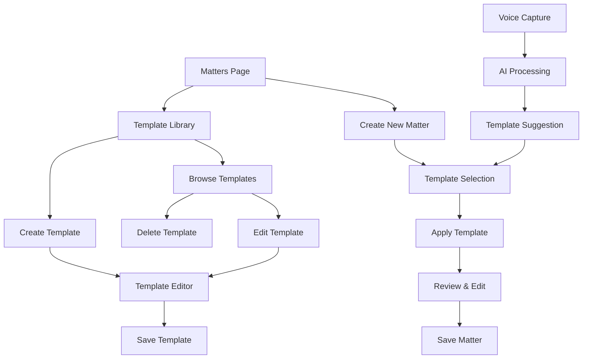

# Matter Templates - Product Requirements Document

## 1. Product Overview

A comprehensive matter template system that allows advocates to save, organize, and reuse common matter configurations, significantly reducing the time required to create new matters and ensuring consistency across similar cases.

The system addresses the inefficiency of repeatedly entering similar matter details for advocates who handle recurring case types, providing a streamlined workflow that integrates seamlessly with existing voice capture and matter creation processes.

This feature targets legal practices handling high volumes of similar matters, potentially reducing matter creation time by 70-80% for templated cases.

## 2. Core Features

### 2.1 User Roles

| Role | Registration Method | Core Permissions |
|------|---------------------|------------------|
| Advocate | Existing system authentication | Can create, edit, delete personal templates; use shared templates |
| Practice Administrator | Elevated advocate permissions | Can create system-wide default templates; manage template sharing |

### 2.2 Feature Module

Our matter templates system consists of the following main pages:
1. **Template Library Page**: template browsing, category filtering, template management dashboard.
2. **Template Editor Modal**: template creation, field configuration, category assignment.
3. **Enhanced Matter Creation**: template selection, template application, hybrid template-manual entry.
4. **Template Settings**: default template configuration, sharing preferences, template categories.

### 2.3 Page Details

| Page Name | Module Name | Feature description |
|-----------|-------------|---------------------|
| Template Library Page | Template Browser | Display all personal and shared templates in categorized grid view with search and filtering |
| Template Library Page | Template Actions | Create new template, edit existing template, delete template, duplicate template, set as default |
| Template Library Page | Category Management | Create custom categories, organize templates by practice area, filter by matter type |
| Template Editor Modal | Template Form | Configure all matter fields, set required vs optional fields, add template metadata |
| Template Editor Modal | Field Configuration | Select which fields to include, set default values, configure field validation rules |
| Template Editor Modal | Template Preview | Preview how template will appear in matter creation, test template application |
| Enhanced Matter Creation | Template Selection | Dropdown to select from available templates, quick template search, recent templates |
| Enhanced Matter Creation | Template Application | Auto-populate form fields from template, allow manual overrides, validate template data |
| Enhanced Matter Creation | Hybrid Mode | Combine template data with voice input, merge multiple templates, partial template application |
| Template Settings | Default Configuration | Set personal default templates by matter type, configure auto-template suggestions |
| Template Settings | Sharing Management | Share templates with other advocates, manage template permissions, import shared templates |
| Template Settings | Voice Integration | Configure voice commands for template selection, set voice-triggered default templates |

## 3. Core Process

**Template Creation Flow:**
Users access the Template Library from the matters page, click "Create Template", fill in the template form with desired default values, assign categories and metadata, save the template for future use.

**Template Usage Flow:**
When creating a new matter, users can select a template from the dropdown, which auto-populates the form fields, then review and modify as needed before saving the matter.

**Voice Integration Flow:**
Users can trigger voice capture with template context, speak matter details that get processed by Claude AI, system suggests relevant templates based on extracted data, user confirms template selection and voice data merges with template defaults.

## 4. User Interface Design

### 4.1 Design Style

- **Primary Colors**: Mpondo Gold (#D4AF37) for template actions, Neutral grays for backgrounds
- **Secondary Colors**: Blue (#3B82F6) for template indicators, Green (#10B981) for success states
- **Button Style**: Rounded corners (8px), subtle shadows, hover state animations
- **Font**: Inter font family, 14px base size for content, 16px for headings
- **Layout Style**: Card-based template grid, clean sidebar navigation, modal overlays for editing
- **Icons**: Lucide React icons for consistency, template-specific icons (bookmark, copy, share)

### 4.2 Page Design Overview

| Page Name | Module Name | UI Elements |
|-----------|-------------|-------------|
| Template Library Page | Template Grid | Card layout with template preview, category badges, action buttons, search bar with filters |
| Template Library Page | Category Sidebar | Collapsible category tree, matter type filters, template count indicators, create category button |
| Template Editor Modal | Form Layout | Multi-step wizard interface, field selection checkboxes, default value inputs, preview panel |
| Template Editor Modal | Field Configuration | Toggle switches for field inclusion, input fields for defaults, validation rule dropdowns |
| Enhanced Matter Creation | Template Selector | Dropdown with template search, template preview tooltip, "No Template" option, recent templates section |
| Enhanced Matter Creation | Template Indicator | Blue background for pre-filled fields, "From Template" badges, clear template button |
| Template Settings | Configuration Panel | Toggle switches for defaults, sharing permission controls, voice command configuration |

### 4.3 Responsiveness

Desktop-first design with mobile-adaptive template library using responsive grid layout. Touch-optimized template selection on mobile devices with swipe gestures for template browsing and tap-friendly action buttons.