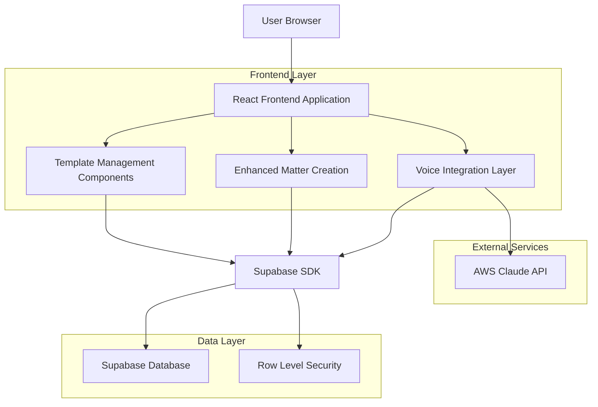
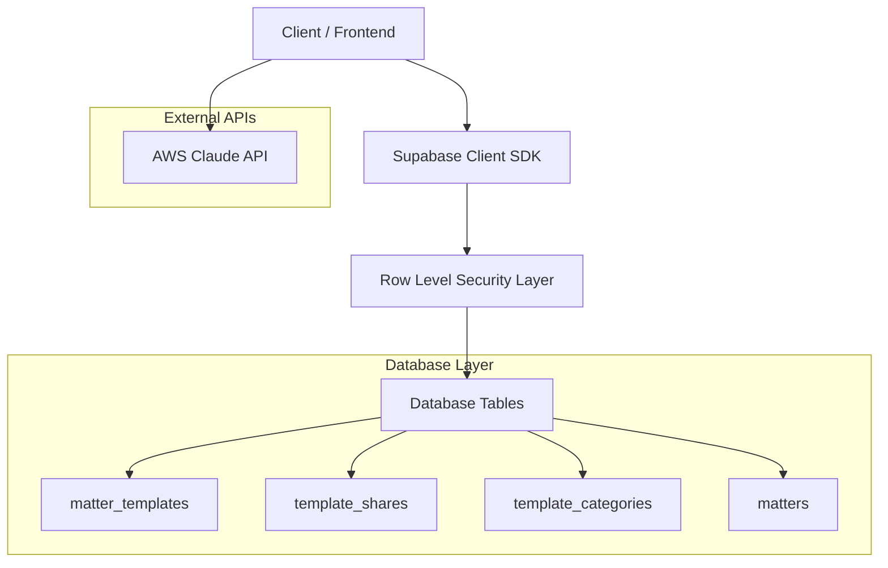
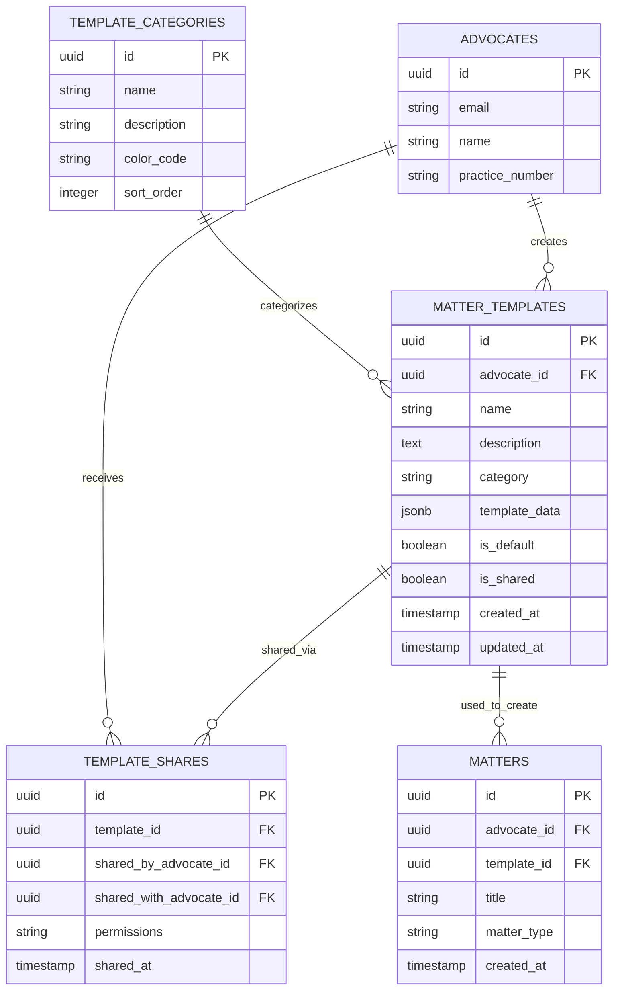

# Matter Templates - Technical Architecture Document

## 1. Architecture Design



## 2. Technology Description

- Frontend: React@18 + TypeScript + Tailwind CSS + Vite
- Backend: Supabase (PostgreSQL + Auth + RLS)
- Voice Integration: AWS Claude API + Web Speech API
- State Management: React Context + useState/useEffect
- UI Components: Existing LexoHub Design System

## 3. Route Definitions

| Route | Purpose |
|-------|---------|
| /matters | Enhanced matters page with template quick actions |
| /matters/templates | Template library and management interface |
| /matters/new | Enhanced matter creation with template selection |
| /settings/templates | Template configuration and sharing settings |

## 4. API Definitions

### 4.1 Core API

**Template Management**

```
GET /api/templates
```

Request:
| Param Name | Param Type | isRequired | Description |
|------------|------------|------------|-------------|
| category | string | false | Filter by template category |
| matter_type | string | false | Filter by matter type |
| shared | boolean | false | Include shared templates |

Response:
| Param Name | Param Type | Description |
|------------|------------|-------------|
| templates | Template[] | Array of template objects |
| total | number | Total template count |

```
POST /api/templates
```

Request:
| Param Name | Param Type | isRequired | Description |
|------------|------------|------------|-------------|
| name | string | true | Template name |
| description | string | false | Template description |
| category | string | true | Template category |
| template_data | object | true | Matter form field values |
| is_default | boolean | false | Set as default template |

Response:
| Param Name | Param Type | Description |
|------------|------------|-------------|
| template | Template | Created template object |
| success | boolean | Operation success status |

```
PUT /api/templates/:id
```

Request:
| Param Name | Param Type | isRequired | Description |
|------------|------------|------------|-------------|
| name | string | false | Updated template name |
| template_data | object | false | Updated field values |
| category | string | false | Updated category |

```
DELETE /api/templates/:id
```

Response:
| Param Name | Param Type | Description |
|------------|------------|-------------|
| success | boolean | Deletion success status |

**Template Sharing**

```
POST /api/templates/:id/share
```

Request:
| Param Name | Param Type | isRequired | Description |
|------------|------------|------------|-------------|
| advocate_ids | string[] | true | Array of advocate IDs to share with |
| permissions | string | true | 'read' or 'copy' permissions |

**Voice Template Integration**

```
POST /api/voice/suggest-template
```

Request:
| Param Name | Param Type | isRequired | Description |
|------------|------------|------------|-------------|
| voice_data | object | true | Extracted voice data from Claude |
| matter_type | string | false | Detected matter type |

Response:
| Param Name | Param Type | Description |
|------------|------------|-------------|
| suggested_templates | Template[] | Relevant template suggestions |
| confidence_scores | number[] | Confidence scores for suggestions |

## 5. Server Architecture Diagram



## 6. Data Model

### 6.1 Data Model Definition



### 6.2 Data Definition Language

**Matter Templates Table**
```sql
-- Create matter templates table
CREATE TABLE matter_templates (
  id UUID PRIMARY KEY DEFAULT gen_random_uuid(),
  advocate_id UUID NOT NULL REFERENCES advocates(id) ON DELETE CASCADE,
  name VARCHAR(255) NOT NULL,
  description TEXT,
  category VARCHAR(100) NOT NULL DEFAULT 'General',
  template_data JSONB NOT NULL,
  is_default BOOLEAN DEFAULT false,
  is_shared BOOLEAN DEFAULT false,
  usage_count INTEGER DEFAULT 0,
  created_at TIMESTAMP WITH TIME ZONE DEFAULT NOW(),
  updated_at TIMESTAMP WITH TIME ZONE DEFAULT NOW(),
  
  CONSTRAINT matter_templates_name_advocate_unique UNIQUE(name, advocate_id)
);

-- Create template sharing table
CREATE TABLE template_shares (
  id UUID PRIMARY KEY DEFAULT gen_random_uuid(),
  template_id UUID NOT NULL REFERENCES matter_templates(id) ON DELETE CASCADE,
  shared_by_advocate_id UUID NOT NULL REFERENCES advocates(id) ON DELETE CASCADE,
  shared_with_advocate_id UUID NOT NULL REFERENCES advocates(id) ON DELETE CASCADE,
  permissions VARCHAR(20) DEFAULT 'read' CHECK (permissions IN ('read', 'copy')),
  shared_at TIMESTAMP WITH TIME ZONE DEFAULT NOW(),
  
  CONSTRAINT template_shares_unique UNIQUE(template_id, shared_with_advocate_id)
);

-- Create template categories table
CREATE TABLE template_categories (
  id UUID PRIMARY KEY DEFAULT gen_random_uuid(),
  name VARCHAR(100) NOT NULL UNIQUE,
  description TEXT,
  color_code VARCHAR(7) DEFAULT '#3B82F6',
  sort_order INTEGER DEFAULT 0,
  created_at TIMESTAMP WITH TIME ZONE DEFAULT NOW()
);

-- Add template reference to matters table
ALTER TABLE matters ADD COLUMN template_id UUID REFERENCES matter_templates(id) ON DELETE SET NULL;

-- Create indexes for performance
CREATE INDEX idx_matter_templates_advocate_id ON matter_templates(advocate_id);
CREATE INDEX idx_matter_templates_category ON matter_templates(category);
CREATE INDEX idx_matter_templates_is_default ON matter_templates(is_default) WHERE is_default = true;
CREATE INDEX idx_template_shares_shared_with ON template_shares(shared_with_advocate_id);
CREATE INDEX idx_template_shares_template_id ON template_shares(template_id);

-- Create updated_at trigger
CREATE OR REPLACE FUNCTION update_updated_at_column()
RETURNS TRIGGER AS $$
BEGIN
  NEW.updated_at = NOW();
  RETURN NEW;
END;
$$ language 'plpgsql';

CREATE TRIGGER update_matter_templates_updated_at 
  BEFORE UPDATE ON matter_templates 
  FOR EACH ROW EXECUTE FUNCTION update_updated_at_column();

-- Row Level Security policies
ALTER TABLE matter_templates ENABLE ROW LEVEL SECURITY;
ALTER TABLE template_shares ENABLE ROW LEVEL SECURITY;

-- Policy: Users can manage their own templates
CREATE POLICY "Users can manage own templates" ON matter_templates
  FOR ALL USING (advocate_id = auth.uid());

-- Policy: Users can view shared templates
CREATE POLICY "Users can view shared templates" ON matter_templates
  FOR SELECT USING (
    is_shared = true OR 
    advocate_id = auth.uid() OR
    id IN (
      SELECT template_id FROM template_shares 
      WHERE shared_with_advocate_id = auth.uid()
    )
  );

-- Policy: Users can manage template shares they created
CREATE POLICY "Users can manage own template shares" ON template_shares
  FOR ALL USING (shared_by_advocate_id = auth.uid());

-- Policy: Users can view shares directed to them
CREATE POLICY "Users can view received shares" ON template_shares
  FOR SELECT USING (shared_with_advocate_id = auth.uid());

-- Insert default template categories
INSERT INTO template_categories (name, description, color_code, sort_order) VALUES
  ('Commercial Litigation', 'Business disputes and commercial matters', '#DC2626', 1),
  ('Contract Law', 'Contract drafting and disputes', '#2563EB', 2),
  ('Employment Law', 'Labour relations and employment matters', '#059669', 3),
  ('Family Law', 'Divorce, custody, and family matters', '#7C3AED', 4),
  ('Criminal Law', 'Criminal defense and prosecution', '#EA580C', 5),
  ('Property Law', 'Real estate and property transactions', '#0891B2', 6),
  ('Intellectual Property', 'Patents, trademarks, and IP matters', '#BE185D', 7),
  ('Tax Law', 'Tax planning and disputes', '#65A30D', 8),
  ('Constitutional Law', 'Constitutional and human rights matters', '#4338CA', 9),
  ('Administrative Law', 'Government and administrative matters', '#92400E', 10),
  ('General', 'General legal matters', '#6B7280', 11);

-- Create function to increment template usage
CREATE OR REPLACE FUNCTION increment_template_usage(template_uuid UUID)
RETURNS void AS $$
BEGIN
  UPDATE matter_templates 
  SET usage_count = usage_count + 1 
  WHERE id = template_uuid;
END;
$$ LANGUAGE plpgsql SECURITY DEFINER;
```