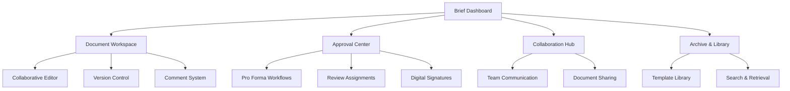

# Shared Brief Portal - Product Requirements Document

## 1. Product Overview
Secure collaborative platform for legal brief sharing, review, and approval workflows between advocates, instructing attorneys, and clients, featuring pro forma approval systems and document version control.

The system enables seamless collaboration on legal briefs while maintaining strict security, confidentiality, and professional standards required for South African legal practice, with integrated approval workflows and audit trails.

## 2. Core Features

### 2.1 User Roles
| Role | Registration Method | Core Permissions |
|------|---------------------|------------------|
| Senior Advocate | Practice invitation | Create briefs, approve submissions, manage collaboration, full access |
| Junior Advocate | Senior advocate invitation | Draft briefs, submit for review, collaborate on documents, limited approval |
| Instructing Attorney | External invitation | View briefs, provide instructions, approve final versions, comment access |
| Client Representative | Attorney invitation | View approved briefs, provide feedback, limited document access |

### 2.2 Feature Module
Our Shared Brief Portal requirements consist of the following main pages:
1. **Brief Dashboard**: Active briefs overview, collaboration status, approval workflows
2. **Document Workspace**: Collaborative editing, version control, comment system
3. **Approval Center**: Pro forma approval workflows, review assignments, status tracking
4. **Collaboration Hub**: Team communication, document sharing, notification center
5. **Archive & Library**: Completed briefs, template library, search and retrieval

### 2.3 Page Details

| Page Name | Module Name | Feature description |
|-----------|-------------|---------------------|
| Brief Dashboard | Active Briefs | Display all active briefs with status indicators, deadlines, and collaboration progress |
| Brief Dashboard | Workflow Status | Visual workflow progress with approval stages, pending actions, and bottlenecks |
| Brief Dashboard | Quick Actions | Fast access to create new briefs, review pending items, and urgent notifications |
| Document Workspace | Collaborative Editor | Real-time collaborative editing with conflict resolution and simultaneous user support |
| Document Workspace | Version Control | Comprehensive version history with diff views, rollback capabilities, and change tracking |
| Document Workspace | Comment System | Contextual commenting with threaded discussions, resolution tracking, and notification system |
| Approval Center | Pro Forma Workflows | Structured approval processes with customizable stages and automatic routing |
| Approval Center | Review Assignments | Assign reviewers, set deadlines, track progress, and manage approval hierarchies |
| Approval Center | Digital Signatures | Secure digital signature integration for final approvals and document authentication |
| Collaboration Hub | Team Communication | Integrated messaging system for brief-specific discussions and team coordination |
| Collaboration Hub | Document Sharing | Secure document sharing with permission controls and access logging |
| Collaboration Hub | Notification Center | Centralized notifications for deadlines, approvals, comments, and system updates |
| Archive & Library | Completed Briefs | Searchable archive of completed briefs with metadata and full-text search |
| Archive & Library | Template Library | Reusable brief templates with customization options and best practice examples |
| Archive & Library | Search & Retrieval | Advanced search capabilities with filters, tags, and AI-powered content discovery |

## 3. Core Process

**Senior Advocate Flow:**
1. Create new brief or assign brief creation to junior advocates
2. Review and approve brief drafts with comments and suggestions
3. Manage collaboration permissions and workflow assignments
4. Provide final approval and digital signature for completed briefs
5. Archive completed briefs and extract reusable templates

**Junior Advocate Flow:**
1. Create and draft briefs using templates and previous examples
2. Collaborate with team members on brief development
3. Submit briefs for senior advocate review and approval
4. Incorporate feedback and revisions from reviewers
5. Assist with research and supporting documentation

**Instructing Attorney Flow:**
1. Provide initial instructions and case requirements
2. Review brief progress and provide feedback during development
3. Approve brief content and approach before finalization
4. Communicate with advocate team on case strategy and requirements

**Client Representative Flow:**
1. Review approved brief summaries and key points
2. Provide feedback on case strategy and approach
3. Access final approved briefs for case understanding
4. Receive notifications on brief completion and next steps

## 4. User Interface Design

### 4.1 Design Style
- **Primary Colors**: Judicial Blue (#1E3A8A) for professional elements, Mpondo Gold (#D4AF37) for approvals
- **Status Colors**: Status Success (#10B981) for approved items, Status Warning (#F59E0B) for pending review, Status Error (#EF4444) for rejected items
- **Button Style**: Professional rounded buttons with clear action hierarchy and approval indicators
- **Font**: Inter for headings (font-semibold), Georgia for document content, JetBrains Mono for metadata
- **Layout Style**: Document-focused layout with sidebar navigation, collaborative editing interface
- **Icons**: Legal and collaboration icons with status indicators and permission badges

### 4.2 Page Design Overview

| Page Name | Module Name | UI Elements |
|-----------|-------------|-------------|
| Brief Dashboard | Active Briefs | Card-based brief overview with progress bars, status badges, and quick action buttons |
| Brief Dashboard | Workflow Status | Kanban-style workflow visualization with drag-and-drop status updates |
| Document Workspace | Collaborative Editor | Split-screen editor with live cursors, comment bubbles, and version indicators |
| Document Workspace | Version Control | Timeline view of versions with diff highlighting and restoration options |
| Approval Center | Pro Forma Workflows | Step-by-step approval process with progress indicators and pending action highlights |
| Approval Center | Digital Signatures | Signature pad interface with certificate validation and audit trail display |
| Collaboration Hub | Team Communication | Chat interface with file attachments, @mentions, and threaded conversations |
| Archive & Library | Search Interface | Advanced search with filters, faceted navigation, and result previews |

### 4.3 Responsiveness
Desktop-first design optimized for document editing and collaboration with tablet support for review and approval workflows. Mobile-responsive for notifications, comments, and basic document viewing.

## 5. Security & Compliance Requirements

### 5.1 Document Security
- **End-to-End Encryption** for all document content and communications
- **Access Control Lists** with granular permission management
- **Audit Logging** for all document access, edits, and sharing activities
- **Digital Rights Management** to prevent unauthorized copying or distribution
- **Secure Document Storage** with backup and disaster recovery capabilities

### 5.2 Professional Compliance
- **Client Confidentiality** maintenance throughout collaboration process
- **Professional Privilege** protection for attorney-client communications
- **Law Society Compliance** with professional conduct and documentation requirements
- **Data Retention Policies** for legal document archival and disposal
- **Conflict of Interest** checking and prevention mechanisms

### 5.3 Collaboration Security
- **User Authentication** with multi-factor authentication for sensitive documents
- **Session Management** with automatic timeouts and secure session handling
- **Permission Inheritance** with role-based access control and delegation
- **External User Management** for instructing attorneys and client representatives
- **Secure Communication** channels for all collaboration activities