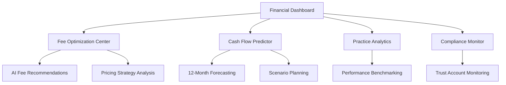

# Strategic Finance & Optimization - Product Requirements Document

## 1. Product Overview
AI-powered financial optimization platform that provides predictive cash flow management, intelligent fee optimization, and strategic financial planning for South African legal practices.

The system leverages AWS Bedrock Claude 3.5 Sonnet to analyze practice patterns, predict financial outcomes, and recommend optimization strategies that increase profitability while maintaining ethical compliance.

## 2. Core Features

### 2.1 User Roles
| Role | Registration Method | Core Permissions |
|------|---------------------|------------------|
| Practice Principal | Admin invitation | Full access to all financial data and optimization tools |
| Senior Advocate | Principal approval | View practice metrics, manage own matters, limited optimization access |
| Junior Advocate | Senior advocate invitation | View own performance metrics, basic financial insights |
| Financial Administrator | Principal designation | Manage financial settings, generate reports, compliance monitoring |

### 2.2 Feature Module
Our Strategic Finance & Optimization requirements consist of the following main pages:
1. **Financial Dashboard**: Real-time cash flow visualization, predictive analytics, key performance indicators
2. **Fee Optimization Center**: AI-powered fee recommendations, pricing strategy analysis, success fee calculations
3. **Cash Flow Predictor**: 12-month cash flow forecasting, scenario planning, risk assessment
4. **Practice Analytics**: Performance benchmarking, profitability analysis, growth trend identification
5. **Compliance Monitor**: Trust account monitoring, ethics alerts, regulatory compliance tracking

### 2.3 Page Details

| Page Name | Module Name | Feature description |
|-----------|-------------|---------------------|
| Financial Dashboard | Real-time Metrics | Display current cash position, outstanding invoices, payment trends with live updates |
| Financial Dashboard | Predictive Analytics | AI-powered 30/60/90-day cash flow predictions with confidence intervals |
| Financial Dashboard | KPI Visualization | Practice efficiency metrics, billing rates, collection ratios with interactive charts |
| Fee Optimization Center | AI Fee Recommendations | Claude-powered analysis of matter types, success rates, market rates for optimal pricing |
| Fee Optimization Center | Pricing Strategy Analysis | Compare different pricing models (hourly, fixed, success fee) with ROI projections |
| Fee Optimization Center | Success Fee Calculator | Calculate optimal success fee percentages based on matter risk and complexity |
| Cash Flow Predictor | 12-Month Forecasting | Machine learning predictions based on historical data and current pipeline |
| Cash Flow Predictor | Scenario Planning | Model different business scenarios (new hires, office expansion, market changes) |
| Cash Flow Predictor | Risk Assessment | Identify cash flow risks and recommend mitigation strategies |
| Practice Analytics | Performance Benchmarking | Compare practice metrics against industry standards and peer practices |
| Practice Analytics | Profitability Analysis | Matter-level and practice-level profitability analysis with drill-down capabilities |
| Practice Analytics | Growth Trend Analysis | Identify growth opportunities and practice development recommendations |
| Compliance Monitor | Trust Account Monitoring | Real-time trust account balance tracking with automated reconciliation |
| Compliance Monitor | Ethics Alerts | Automated alerts for potential ethics violations or compliance issues |
| Compliance Monitor | Regulatory Compliance | Track compliance with Law Society requirements and generate compliance reports |

## 3. Core Process

**Practice Principal Flow:**
1. Access Financial Dashboard to review current financial position
2. Use AI Fee Recommendations to optimize pricing for new matters
3. Review Cash Flow Predictions and adjust business strategy accordingly
4. Monitor compliance status and address any alerts
5. Generate strategic reports for practice planning

**Senior Advocate Flow:**
1. View personal performance metrics and billing efficiency
2. Access fee optimization recommendations for their matters
3. Review cash flow impact of their practice area
4. Monitor compliance requirements for their matters

## 4. User Interface Design

### 4.1 Design Style
- **Primary Colors**: Mpondo Gold (#D4AF37) for financial success indicators, Judicial Blue (#1E3A8A) for professional elements
- **Secondary Colors**: Status Success (#10B981) for positive metrics, Status Warning (#F59E0B) for alerts, Status Error (#EF4444) for compliance issues
- **Button Style**: Rounded corners with subtle shadows, 3D effect for primary actions
- **Font**: Inter for headings (font-semibold), JetBrains Mono for financial figures and data
- **Layout Style**: Card-based dashboard with responsive grid layout, top navigation with financial quick stats
- **Icons**: Financial and analytics-focused icons with consistent stroke width

### 4.2 Page Design Overview

| Page Name | Module Name | UI Elements |
|-----------|-------------|-------------|
| Financial Dashboard | Real-time Metrics | Large metric cards with animated counters, color-coded status indicators, trend sparklines |
| Financial Dashboard | Predictive Analytics | Interactive line charts with confidence bands, hover tooltips, time range selectors |
| Fee Optimization Center | AI Recommendations | Card-based recommendations with confidence scores, comparison tables, action buttons |
| Cash Flow Predictor | Forecasting Charts | Multi-line charts with scenario overlays, interactive legends, zoom controls |
| Compliance Monitor | Alert System | Priority-based alert cards with severity colors, action buttons, dismissal options |

### 4.3 Responsiveness
Desktop-first design with mobile-adaptive layouts. Touch-optimized controls for mobile devices with swipe gestures for chart navigation and tap-friendly button sizing.

## 5. Technical Requirements

### 5.1 AI Integration
- **AWS Bedrock Claude 3.5 Sonnet** for financial analysis and recommendations
- **Machine Learning Models** for cash flow prediction and pattern recognition
- **Natural Language Processing** for generating financial insights and recommendations

### 5.2 Data Sources
- **Supabase Database** for practice financial data and historical metrics
- **Invoice Management System** for billing and payment data
- **Matter Management System** for case profitability analysis
- **External APIs** for market rate data and industry benchmarks

### 5.3 Security & Compliance
- **Encryption** for all financial data at rest and in transit
- **Audit Logging** for all financial transactions and access
- **Role-based Access Control** for sensitive financial information
- **Compliance Monitoring** for Law Society of South Africa requirements