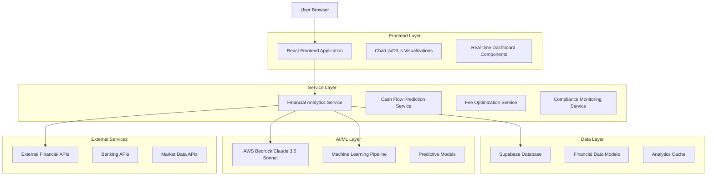
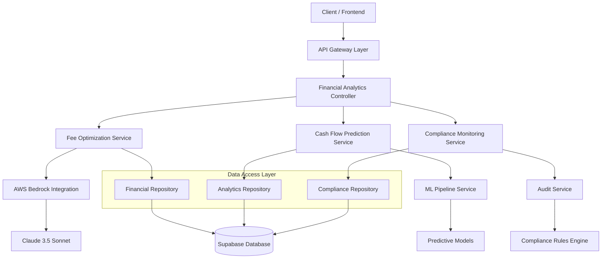
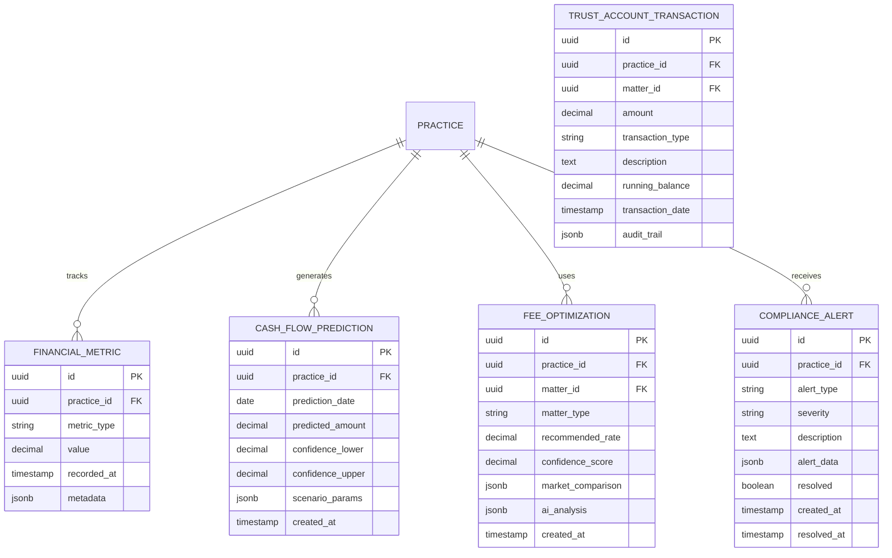

# Strategic Finance & Optimization - Technical Architecture Document

## 1. Architecture Design



## 2. Technology Description

- **Frontend**: React@18 + TypeScript + Tailwind CSS + Vite + Chart.js + React Query
- **Backend**: Supabase + Edge Functions + PostgreSQL
- **AI/ML**: AWS Bedrock Claude 3.5 Sonnet + Custom ML Models
- **Visualization**: Chart.js + D3.js for complex financial charts
- **Real-time**: Supabase Realtime for live financial updates

## 3. Route Definitions

| Route | Purpose |
|-------|---------|
| /finance | Financial dashboard with real-time metrics and KPIs |
| /finance/optimization | Fee optimization center with AI recommendations |
| /finance/cashflow | Cash flow predictor with scenario planning |
| /finance/analytics | Practice analytics and performance benchmarking |
| /finance/compliance | Compliance monitoring and trust account tracking |
| /finance/reports | Financial reporting and export functionality |

## 4. API Definitions

### 4.1 Core Financial APIs

**Get Financial Dashboard Data**
```
GET /api/finance/dashboard
```

Request:
| Param Name | Param Type | isRequired | Description |
|------------|------------|------------|-------------|
| period | string | false | Time period (30d, 90d, 1y) |
| practice_id | string | true | Practice identifier |

Response:
| Param Name | Param Type | Description |
|------------|------------|-------------|
| cash_position | number | Current cash position |
| outstanding_invoices | number | Total outstanding invoices |
| monthly_revenue | number | Current month revenue |
| collection_rate | number | Payment collection percentage |
| predictions | object | AI-generated predictions |

**Get Fee Optimization Recommendations**
```
POST /api/finance/fee-optimization
```

Request:
| Param Name | Param Type | isRequired | Description |
|------------|------------|------------|-------------|
| matter_type | string | true | Type of legal matter |
| complexity | string | true | Matter complexity (low, medium, high) |
| client_profile | object | true | Client information and history |
| market_data | object | false | Current market rate data |

Response:
| Param Name | Param Type | Description |
|------------|------------|-------------|
| recommended_rate | number | AI-recommended hourly rate |
| confidence_score | number | Confidence in recommendation (0-1) |
| market_comparison | object | Comparison with market rates |
| success_fee_options | array | Alternative success fee structures |

**Generate Cash Flow Prediction**
```
POST /api/finance/cashflow-prediction
```

Request:
| Param Name | Param Type | isRequired | Description |
|------------|------------|------------|-------------|
| forecast_period | number | true | Months to forecast (1-12) |
| scenario_params | object | false | Scenario planning parameters |
| historical_data | boolean | false | Include historical analysis |

Response:
| Param Name | Param Type | Description |
|------------|------------|-------------|
| predictions | array | Monthly cash flow predictions |
| confidence_intervals | array | Upper and lower bounds |
| risk_factors | array | Identified risk factors |
| recommendations | array | AI-generated recommendations |

## 5. Server Architecture Diagram



## 6. Data Model

### 6.1 Data Model Definition



### 6.2 Data Definition Language

**Financial Metrics Table**
```sql
-- Create financial_metrics table
CREATE TABLE financial_metrics (
    id UUID PRIMARY KEY DEFAULT gen_random_uuid(),
    practice_id UUID NOT NULL REFERENCES practices(id),
    metric_type VARCHAR(50) NOT NULL,
    value DECIMAL(15,2) NOT NULL,
    recorded_at TIMESTAMP WITH TIME ZONE DEFAULT NOW(),
    metadata JSONB DEFAULT '{}',
    created_at TIMESTAMP WITH TIME ZONE DEFAULT NOW()
);

-- Create indexes
CREATE INDEX idx_financial_metrics_practice_id ON financial_metrics(practice_id);
CREATE INDEX idx_financial_metrics_type_date ON financial_metrics(metric_type, recorded_at DESC);
CREATE INDEX idx_financial_metrics_recorded_at ON financial_metrics(recorded_at DESC);

-- Grant permissions
GRANT SELECT ON financial_metrics TO anon;
GRANT ALL PRIVILEGES ON financial_metrics TO authenticated;
```

**Cash Flow Predictions Table**
```sql
-- Create cash_flow_predictions table
CREATE TABLE cash_flow_predictions (
    id UUID PRIMARY KEY DEFAULT gen_random_uuid(),
    practice_id UUID NOT NULL REFERENCES practices(id),
    prediction_date DATE NOT NULL,
    predicted_amount DECIMAL(15,2) NOT NULL,
    confidence_lower DECIMAL(15,2) NOT NULL,
    confidence_upper DECIMAL(15,2) NOT NULL,
    scenario_params JSONB DEFAULT '{}',
    model_version VARCHAR(20) DEFAULT 'v1.0',
    created_at TIMESTAMP WITH TIME ZONE DEFAULT NOW()
);

-- Create indexes
CREATE INDEX idx_cashflow_practice_date ON cash_flow_predictions(practice_id, prediction_date);
CREATE INDEX idx_cashflow_created_at ON cash_flow_predictions(created_at DESC);

-- Grant permissions
GRANT SELECT ON cash_flow_predictions TO anon;
GRANT ALL PRIVILEGES ON cash_flow_predictions TO authenticated;
```

**Fee Optimizations Table**
```sql
-- Create fee_optimizations table
CREATE TABLE fee_optimizations (
    id UUID PRIMARY KEY DEFAULT gen_random_uuid(),
    practice_id UUID NOT NULL REFERENCES practices(id),
    matter_id UUID REFERENCES matters(id),
    matter_type VARCHAR(100) NOT NULL,
    recommended_rate DECIMAL(10,2) NOT NULL,
    confidence_score DECIMAL(3,2) NOT NULL CHECK (confidence_score >= 0 AND confidence_score <= 1),
    market_comparison JSONB DEFAULT '{}',
    ai_analysis JSONB DEFAULT '{}',
    applied BOOLEAN DEFAULT FALSE,
    created_at TIMESTAMP WITH TIME ZONE DEFAULT NOW()
);

-- Create indexes
CREATE INDEX idx_fee_opt_practice_id ON fee_optimizations(practice_id);
CREATE INDEX idx_fee_opt_matter_type ON fee_optimizations(matter_type);
CREATE INDEX idx_fee_opt_created_at ON fee_optimizations(created_at DESC);

-- Grant permissions
GRANT SELECT ON fee_optimizations TO anon;
GRANT ALL PRIVILEGES ON fee_optimizations TO authenticated;
```

**Compliance Alerts Table**
```sql
-- Create compliance_alerts table
CREATE TABLE compliance_alerts (
    id UUID PRIMARY KEY DEFAULT gen_random_uuid(),
    practice_id UUID NOT NULL REFERENCES practices(id),
    alert_type VARCHAR(50) NOT NULL,
    severity VARCHAR(20) NOT NULL CHECK (severity IN ('low', 'medium', 'high', 'critical')),
    description TEXT NOT NULL,
    alert_data JSONB DEFAULT '{}',
    resolved BOOLEAN DEFAULT FALSE,
    resolved_by UUID REFERENCES auth.users(id),
    created_at TIMESTAMP WITH TIME ZONE DEFAULT NOW(),
    resolved_at TIMESTAMP WITH TIME ZONE
);

-- Create indexes
CREATE INDEX idx_compliance_alerts_practice_id ON compliance_alerts(practice_id);
CREATE INDEX idx_compliance_alerts_severity ON compliance_alerts(severity);
CREATE INDEX idx_compliance_alerts_resolved ON compliance_alerts(resolved, created_at DESC);

-- Grant permissions
GRANT SELECT ON compliance_alerts TO anon;
GRANT ALL PRIVILEGES ON compliance_alerts TO authenticated;
```

**Trust Account Transactions Table**
```sql
-- Create trust_account_transactions table
CREATE TABLE trust_account_transactions (
    id UUID PRIMARY KEY DEFAULT gen_random_uuid(),
    practice_id UUID NOT NULL REFERENCES practices(id),
    matter_id UUID REFERENCES matters(id),
    amount DECIMAL(15,2) NOT NULL,
    transaction_type VARCHAR(50) NOT NULL,
    description TEXT NOT NULL,
    running_balance DECIMAL(15,2) NOT NULL,
    transaction_date TIMESTAMP WITH TIME ZONE DEFAULT NOW(),
    audit_trail JSONB DEFAULT '{}',
    created_at TIMESTAMP WITH TIME ZONE DEFAULT NOW()
);

-- Create indexes
CREATE INDEX idx_trust_transactions_practice_id ON trust_account_transactions(practice_id);
CREATE INDEX idx_trust_transactions_matter_id ON trust_account_transactions(matter_id);
CREATE INDEX idx_trust_transactions_date ON trust_account_transactions(transaction_date DESC);

-- Grant permissions
GRANT SELECT ON trust_account_transactions TO anon;
GRANT ALL PRIVILEGES ON trust_account_transactions TO authenticated;

-- Initial data for testing
INSERT INTO financial_metrics (practice_id, metric_type, value, metadata)
SELECT 
    p.id,
    'monthly_revenue',
    50000.00,
    '{"currency": "ZAR", "period": "2024-01"}'
FROM practices p
LIMIT 1;
```