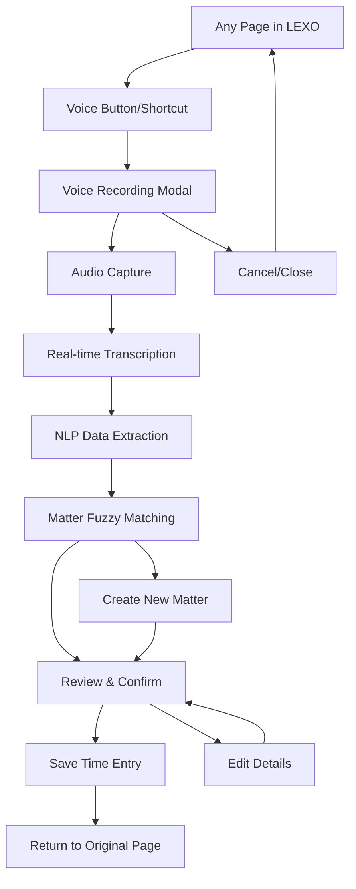

# Voice-First Time Capture - Product Requirements Document

## 1. Product Overview

Voice-First Time Capture is LEXO's killer differentiator that enables South African legal professionals to capture billable time entries through natural voice commands from anywhere in the application. This feature transforms time tracking from a tedious administrative task into an effortless, mobile-first experience that works seamlessly whether advocates are in court, traveling, or between client meetings.

The system leverages advanced speech recognition optimized for South African accents and intelligent NLP to automatically extract matter details, duration, activity types, and billing information from natural speech patterns. This addresses the critical pain point of lost billable time due to delayed or forgotten time entry, directly impacting law firm profitability and advocate productivity.

Target market value: Increase billable time capture by 25-40% and reduce administrative overhead by 60% for South African legal practices.

## 2. Core Features

### 2.1 User Roles

| Role | Registration Method | Core Permissions |
|------|---------------------|------------------|
| Advocate | Email registration with Bar Council verification | Full voice capture access, matter association, billing controls |
| Junior Advocate | Invitation from senior advocate | Voice capture with supervisor approval for billing |
| Practice Manager | Admin invitation | Voice capture oversight, analytics access, system configuration |

### 2.2 Feature Module

Our Voice-First Time Capture system consists of the following essential components:

1. **Global Voice Access Interface**: Persistent microphone button, keyboard shortcuts, mobile floating action button
2. **Voice Recording Modal**: Real-time audio capture with visual feedback and recording controls
3. **Speech-to-Text Processing**: Multi-provider transcription with South African accent optimization
4. **NLP Data Extraction**: Intelligent parsing of legal terminology and time entry details
5. **Matter Matching Interface**: Fuzzy matching with confidence scoring and manual override options
6. **Time Entry Confirmation**: Review and edit extracted data before saving to matter records

### 2.3 Page Details

| Page Name | Module Name | Feature Description |
|-----------|-------------|---------------------|
| Global Navigation | Voice Access Button | Persistent microphone icon in top navigation. Click to open voice modal. Keyboard shortcut Cmd/Ctrl+Shift+V. Visual recording indicator when active. |
| Mobile Interface | Floating Action Button | Bottom-right FAB for easy thumb access. Haptic feedback on tap. Optimized for one-handed operation. Auto-hide during scrolling. |
| Voice Recording Modal | Audio Capture | Real-time waveform visualization. Start/stop/pause controls. Recording duration timer. Audio level indicators. Background noise detection. |
| Voice Recording Modal | Transcription Display | Live transcription preview. Confidence scoring indicators. Edit transcription capability. Multiple language support (English, Afrikaans). |
| Voice Recording Modal | Data Extraction Panel | Extracted matter name/client. Parsed duration and activity type. Date/time detection. Billable status determination. Confidence scores for each field. |
| Voice Recording Modal | Matter Matching | Fuzzy search results for client/matter. Confidence percentage display. Manual selection override. Create new matter option. Recent matters quick access. |
| Voice Recording Modal | Confirmation Interface | Review extracted time entry. Edit any field before saving. Preview billing impact. Save to matter or draft. Keyboard navigation support. |

## 3. Core Process

**Primary User Flow - Voice Time Capture:**
1. Advocate activates voice capture via button click or keyboard shortcut
2. System opens voice modal and begins audio recording
3. Real-time transcription displays as advocate speaks naturally about work performed
4. NLP processor extracts structured data (matter, duration, activity, billing status)
5. System presents fuzzy-matched matters with confidence scores
6. Advocate reviews and confirms extracted time entry details
7. Time entry saves to selected matter with full audit trail

**Mobile-Optimized Flow:**
1. Advocate taps floating action button (optimized for thumb access)
2. Haptic feedback confirms activation
3. Large, touch-friendly recording interface appears
4. Voice-guided prompts assist with data capture
5. Swipe gestures for quick confirmation/editing
6. Auto-save with offline sync capability

## 4. User Interface Design

### 4.1 Design Style

- **Primary Colors**: LEXO Gold (#D4AF37) for voice activation states, Neutral Gray (#6B7280) for inactive states
- **Secondary Colors**: Success Green (#10B981) for confirmed entries, Warning Amber (#F59E0B) for low confidence
- **Button Style**: Rounded corners (8px radius) with subtle shadows, 3D effect on press for tactile feedback
- **Font**: Inter font family, 16px base size for accessibility, 14px for secondary text, 18px for modal headers
- **Layout Style**: Card-based modal design with clear visual hierarchy, top navigation integration, mobile-first responsive design
- **Icons**: Lucide React icons with 24px size for primary actions, microphone pulse animation during recording, waveform visualization for audio feedback

### 4.2 Page Design Overview

| Page Name | Module Name | UI Elements |
|-----------|-------------|-------------|
| Global Navigation | Voice Access Button | Gold circular button with microphone icon. Pulse animation when recording. Tooltip "Quick Capture (Ctrl+Shift+V)". 44px touch target for mobile. |
| Mobile Interface | Floating Action Button | 56px circular FAB in bottom-right. Gold background with white mic icon. Elevation shadow. Haptic feedback. Auto-hide on scroll. |
| Voice Recording Modal | Audio Interface | Full-screen overlay on mobile, centered modal on desktop. Dark semi-transparent backdrop. Waveform visualization in real-time. Large start/stop button (64px). |
| Voice Recording Modal | Transcription Panel | White background with subtle border. Live text updates with typing animation. Confidence indicators as colored underlines. Edit icon for manual correction. |
| Voice Recording Modal | Data Extraction | Card layout with labeled fields. Green checkmarks for high confidence. Amber warnings for uncertain matches. Clear visual separation between sections. |
| Voice Recording Modal | Matter Selection | Dropdown with search functionality. Confidence percentages as progress bars. Client avatars for visual recognition. "Create New" option prominently displayed. |

### 4.3 Responsiveness

Desktop-first design with mobile-adaptive optimization. Touch interaction prioritized for mobile with larger tap targets (minimum 44px). Keyboard navigation fully supported for accessibility. Haptic feedback on supported mobile devices. Offline capability with sync indicators. Voice prompts for hands-free operation during recording.

