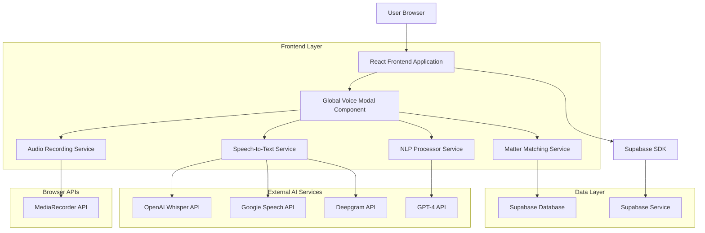
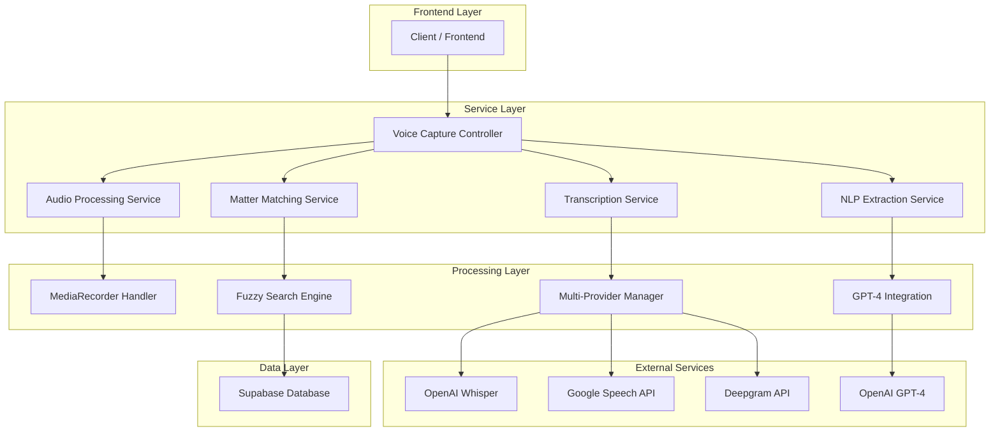
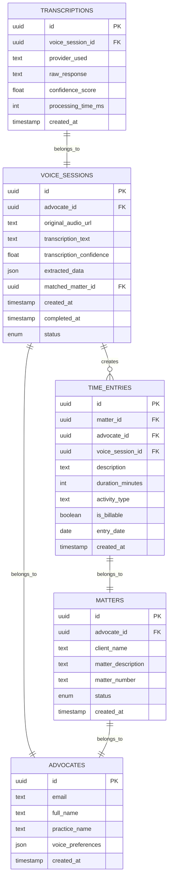

# Voice-First Time Capture - Technical Architecture Document

## 1. Architecture Design



## 2. Technology Description

- **Frontend**: React@18 + TypeScript + Tailwind CSS@3 + Vite
- **Audio Processing**: MediaRecorder API + Web Audio API for real-time visualization
- **Speech Recognition**: Multi-provider (OpenAI Whisper, Google Speech, Deepgram)
- **NLP Processing**: OpenAI GPT-4 for intelligent data extraction
- **Database**: Supabase (PostgreSQL) for matter storage and fuzzy matching
- **State Management**: React Context + Custom hooks for voice session management
- **UI Components**: Lucide React icons + Custom audio visualization components

## 3. Route Definitions

| Route | Purpose |
|-------|---------|
| /dashboard | Main dashboard with global voice access button |
| /matters | Matters page with voice capture for specific matter time entries |
| /invoices | Invoice page with voice capture for billing-related entries |
| /proforma | Pro forma page with voice capture integration |
| /* | Global voice modal accessible from any route via keyboard shortcut |

## 4. API Definitions

### 4.1 Core Voice Capture APIs

**Audio Transcription Service**
```typescript
POST /api/voice/transcribe
```

Request:
| Param Name | Param Type | isRequired | Description |
|------------|------------|------------|-------------|
| audioBlob | Blob | true | Audio recording in WebM/MP4 format |
| language | string | false | Language code (default: 'en-ZA') |
| provider | string | false | Transcription provider ('whisper', 'google', 'deepgram') |

Response:
| Param Name | Param Type | Description |
|------------|------------|-------------|
| text | string | Transcribed text content |
| confidence | number | Transcription confidence score (0-1) |
| language | string | Detected language |
| processingTime | number | Processing time in milliseconds |

Example:
```json
{
  "text": "I worked on the Smith matter for 2 hours reviewing the commercial lease agreement",
  "confidence": 0.95,
  "language": "en-ZA",
  "processingTime": 1250
}
```

**NLP Data Extraction Service**
```typescript
POST /api/voice/extract
```

Request:
| Param Name | Param Type | isRequired | Description |
|------------|------------|------------|-------------|
| transcription | string | true | Transcribed text to process |
| availableMatters | Matter[] | false | User's available matters for matching |

Response:
| Param Name | Param Type | Description |
|------------|------------|-------------|
| matterId | string | Matched matter ID |
| clientName | string | Extracted client name |
| durationMinutes | number | Parsed duration in minutes |
| activityType | string | Categorized activity type |
| description | string | Cleaned description text |
| confidence | number | Overall extraction confidence |
| isBillable | boolean | Determined billable status |

Example:
```json
{
  "matterId": "matter_123",
  "clientName": "Smith Corporation",
  "durationMinutes": 120,
  "activityType": "document_review",
  "description": "Reviewing commercial lease agreement and preparing amendments",
  "confidence": 0.87,
  "isBillable": true
}
```

**Matter Fuzzy Matching Service**
```typescript
POST /api/voice/match-matter
```

Request:
| Param Name | Param Type | isRequired | Description |
|------------|------------|------------|-------------|
| clientName | string | false | Extracted client name |
| matterName | string | false | Extracted matter reference |
| userId | string | true | Current user ID for scope |

Response:
| Param Name | Param Type | Description |
|------------|------------|-------------|
| matches | MatchResult[] | Array of potential matter matches |
| confidence | number | Best match confidence score |
| suggestions | string[] | Alternative search suggestions |

Example:
```json
{
  "matches": [
    {
      "matterId": "matter_123",
      "clientName": "Smith Corporation",
      "matterDescription": "Commercial Lease Review",
      "confidence": 0.92
    }
  ],
  "confidence": 0.92,
  "suggestions": ["Smith Corp", "Smith Holdings"]
}
```

## 5. Server Architecture Diagram



## 6. Data Model

### 6.1 Data Model Definition



### 6.2 Data Definition Language

**Voice Sessions Table**
```sql
-- Create voice sessions table
CREATE TABLE voice_sessions (
    id UUID PRIMARY KEY DEFAULT gen_random_uuid(),
    advocate_id UUID NOT NULL REFERENCES advocates(id) ON DELETE CASCADE,
    original_audio_url TEXT,
    transcription_text TEXT,
    transcription_confidence FLOAT DEFAULT 0,
    extracted_data JSONB DEFAULT '{}',
    matched_matter_id UUID REFERENCES matters(id),
    status VARCHAR(20) DEFAULT 'recording' CHECK (status IN ('recording', 'transcribing', 'processing', 'completed', 'failed')),
    created_at TIMESTAMP WITH TIME ZONE DEFAULT NOW(),
    completed_at TIMESTAMP WITH TIME ZONE,
    updated_at TIMESTAMP WITH TIME ZONE DEFAULT NOW()
);

-- Create transcriptions table for provider tracking
CREATE TABLE transcriptions (
    id UUID PRIMARY KEY DEFAULT gen_random_uuid(),
    voice_session_id UUID NOT NULL REFERENCES voice_sessions(id) ON DELETE CASCADE,
    provider_used VARCHAR(20) NOT NULL CHECK (provider_used IN ('whisper', 'google', 'deepgram')),
    raw_response JSONB NOT NULL,
    confidence_score FLOAT DEFAULT 0,
    processing_time_ms INTEGER DEFAULT 0,
    created_at TIMESTAMP WITH TIME ZONE DEFAULT NOW()
);

-- Create indexes for performance
CREATE INDEX idx_voice_sessions_advocate_id ON voice_sessions(advocate_id);
CREATE INDEX idx_voice_sessions_status ON voice_sessions(status);
CREATE INDEX idx_voice_sessions_created_at ON voice_sessions(created_at DESC);
CREATE INDEX idx_transcriptions_voice_session_id ON transcriptions(voice_session_id);
CREATE INDEX idx_transcriptions_provider ON transcriptions(provider_used);

-- Add voice session reference to time entries
ALTER TABLE time_entries ADD COLUMN voice_session_id UUID REFERENCES voice_sessions(id);
CREATE INDEX idx_time_entries_voice_session ON time_entries(voice_session_id);

-- Add voice preferences to advocates
ALTER TABLE advocates ADD COLUMN voice_preferences JSONB DEFAULT '{"preferred_provider": "whisper", "auto_save": true, "confidence_threshold": 0.8}';

-- Row Level Security policies
ALTER TABLE voice_sessions ENABLE ROW LEVEL SECURITY;
ALTER TABLE transcriptions ENABLE ROW LEVEL SECURITY;

-- Advocates can only access their own voice sessions
CREATE POLICY "Advocates can view own voice sessions" ON voice_sessions
    FOR ALL USING (advocate_id = auth.uid());

-- Advocates can only access transcriptions for their voice sessions
CREATE POLICY "Advocates can view own transcriptions" ON transcriptions
    FOR ALL USING (
        voice_session_id IN (
            SELECT id FROM voice_sessions WHERE advocate_id = auth.uid()
        )
    );

-- Grant permissions
GRANT SELECT, INSERT, UPDATE ON voice_sessions TO authenticated;
GRANT SELECT, INSERT ON transcriptions TO authenticated;
GRANT SELECT ON voice_sessions TO anon;

-- Initial data for testing
INSERT INTO voice_sessions (advocate_id, transcription_text, transcription_confidence, extracted_data, status)
VALUES (
    (SELECT id FROM advocates LIMIT 1),
    'I worked on the Smith matter for 2 hours reviewing the commercial lease agreement and preparing amendments',
    0.95,
    '{"duration_minutes": 120, "activity_type": "document_review", "client_name": "Smith Corporation", "is_billable": true}',
    'completed'
);
```

**Voice Capture Service Configuration**
```sql
-- Create configuration table for voice services
CREATE TABLE voice_service_config (
    id UUID PRIMARY KEY DEFAULT gen_random_uuid(),
    service_name VARCHAR(50) NOT NULL UNIQUE,
    api_endpoint TEXT NOT NULL,
    is_enabled BOOLEAN DEFAULT true,
    priority_order INTEGER DEFAULT 1,
    config_data JSONB DEFAULT '{}',
    created_at TIMESTAMP WITH TIME ZONE DEFAULT NOW(),
    updated_at TIMESTAMP WITH TIME ZONE DEFAULT NOW()
);

-- Insert default service configurations
INSERT INTO voice_service_config (service_name, api_endpoint, priority_order, config_data) VALUES
('whisper', 'https://api.openai.com/v1/audio/transcriptions', 1, '{"model": "whisper-1", "language": "en"}'),
('google', 'https://speech.googleapis.com/v1/speech:recognize', 2, '{"language_code": "en-ZA", "enable_automatic_punctuation": true}'),
('deepgram', 'https://api.deepgram.com/v1/listen', 3, '{"model": "nova", "language": "en-ZA"}');
```